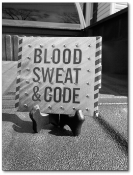
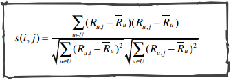

## 本书的结构

这本书按照边学边做的原则编写。与其被动地接受书中的内容，我建议读者使用书中提供的Python代码来进行实践。尝试各种算法，做一些修改，使用不同的数据集查看效果，从而真正地掌握这些知识和技术。

我会尝试在简单易懂的Python代码和其背后的算法逻辑之间找到平衡点。为了避免读者们为各种理论、数学公式、以及Python代码绞尽脑汁，我会增加图表和插画来做调剂。

谷歌研究院总监诺维格曾在他的Udacity课程《计算机程序设计》中写道：

> 我会向你展示和讨论我的解决方案。但需要注意的是，解决问题的方案不止一个。并不是说我的方案是 *唯一的* 或 *最好的* 。我的方案不过是帮助你学习编程的一种风格和技术。如果你用另一种方式解决了问题，那会非常好。

> 所有的学习过程都是在你的头脑中发生的，而不是我的。所以你需要非常了解你的代码和我的代码之间的关系——你需要自己编写出答案，然后从我的代码中挑选出有用的部分来学习和借鉴。

**我非常赞同这个观点**

图文：用血和汗水来编程！

这本书并不是一本完整论述数据挖掘技术的教科书。市面上有一些这样的教科书，如由谭恩、
斯坦巴克、以及库马合著的[《数据挖掘导论》](http://www.amazon.com/Introduction-Data-Mining-Pang-Ning-Tan/dp/0321321367/)，就很全面地讲解了数据挖掘的各种理论，及其背后的数学知识。

而你正在阅读的这本书，只是帮助你快速了解数据挖掘的基础理论，并进行实践。读完本书后，你可以再找一本完整的教科书来填补空白。

这本书另一个比较实用的地方是它所提供的Python代码和数据集。我认为这可以帮助读者更快速地掌握数据挖掘的核心思想，而又不会陷得太深，事倍功半。

### 读完本书后你将能够做些什么事？

读完本书后，你将有能力使用Python或其它编程语言，为一个网站设计和实现一套推荐系统。

例如，你在亚马逊上浏览一件商品，或者在潘多拉上聆听一首音乐，你可得到一组相关产品的列表（也就是“猜你喜欢”）。你会学到如何开发出这样一套系统。

此外，这部分书提到的相关术语可以让你能够顺畅地与数据挖掘团队作沟通。

作为目标的一部分，本书还将为你揭开推荐系统的神秘面纱，包括那些恐怖分子识别系统及其他数据挖掘系统，至少你将知道这些系统是怎么运作的。

**为什么这点很重要？**

为什么你需要花时间来阅读本书呢？在本章的开始，我给出了很多示例来说明数据挖掘的重要性。

那段文字可以转述如下：市场上有很多商品（电影、音乐、书籍、烹饪器具），而且数量在不断增加，随之而来的问题便是如何在这么多商品中找到我们最感兴趣的——那么多电影我该看哪部？我接下来应该读哪本书？数据挖掘就是用来解决这类问题的。

大多数网站都会提供查找商品的功能，除了上面提到的商品，你还会考虑该关注哪位好友；是否能够有一份报纸只刊登你感兴趣的文章？如果你是一名Web开发者，就非常需要了解数据挖掘方面的知识了。

好，现在你应该了解为什么要花时间来学习数据挖掘了，但为何要选择这本书呢？

市面上有些书籍是非技术类的，描述了数据挖掘的大致情况。这些书可以快速翻阅，十分有趣，而且不贵，很适合深夜阅读（因为没有繁杂的技术细节）。

这类书籍的最佳代表是贝克的《数学奇才》，我非常推荐这本书。在我往来弗吉尼亚和新墨西哥时就听的是这本书的语音版。另一个极端则是数据挖掘教学中使用的教科书。这些书籍涵盖面广，将数据挖掘的理论和实践讲解得非常透彻，所以我也推荐阅读这类书籍。

至于这本书，则是用来填补这两者之间的空白的。本书的目标读者是那些喜欢编程的骇客们。

*这本书应该在电脑前阅读，这样读者就可以立刻编写代码参与其中。*

*天呐，这是什么？这本书会包含一些数学公式，不过我会用一种简明的方式表述，相信普通的程序员都能了解，即便你已经忘记了大学中学习数学知识。*

如果以上这些都不能说服你，那还有一点：这本书是免费的，你可以随意分享它。

### 标题中的“数学奇才的古老艺术”有什么含义？

2010年6月，我曾尝试给这本书起一个合适的标题。我喜欢有趣的标题，但很可惜我不太擅长起名字。

近期，我发表了篇关于数据挖掘的论文，名为《扎入文字堆：阿拉伯文字的地域化分类》。我喜欢这个标题，不过我得承认这是我的太太帮我取的。

我曾和马克肖恩合著了一篇论文，名为《情绪与模式：从理论到争辩》，这个标题也是我的搭档取的。

总之，六月时我取的那些标题很难一眼看出这本书讲的是什么，所以我最后用了《面向程序员的数据挖掘指南》作为标题的一部分，因为这个标题和本书的内容非常契合——这本书是提供给正在从事编程工作的人员阅读的。也许你会疑惑子标题究竟是什么意思：

数学奇才（Numerati）是贝克自己创造的一个词语。如今，我们每个人无时无刻不在创造着新的数据，信用卡购物记录、推特、格瓦拉上的博客、Foursquare上的签到、手机通话记录、电子邮件、文字短信等。

当你一早醒来，“矩阵”就知道你会乘坐雾谷站7:10的地铁，并于7:32在西站下车；矩阵知道7:45分你会去第五大街的星巴克买上一杯大杯拿铁和一份蓝莓饼；8:05分，你用格瓦拉在上班地点签到；9:35分，你在亚马逊上购买了一套瘦身教程DVD和一副门上单杠；你在Golden Falafel吃的午餐。

贝克在书中这样写道：

> 只有那些数学家、计算机科学家、以及工程师们才能从这些庞大的数据集中获得有用的信息。这些数学奇才会从这些数据中了解到什么？首先，他们能够准确地定位到我们。比如你是纽约北部市郊的一个潜在的SUV客户，或是一个经常去教堂做礼拜的人，或是阿尔伯克基市的一名反堕胎的民主党人士；也许你是一个即将被调任到海得拉巴市的一名Java工程师，或是一个热爱爵士乐的人；你是射手座的，喜欢喝勤地酒，想在乡野间漫步，最后在斯德哥尔摩的篝火旁酣睡；更夸张的，也许你腰绑炸弹，正乘上一部公交车。无论你是谁，处在茫茫人海中，那些公司或政府机构都能掌握你的行踪。

你可能猜到了，起这个标题是因为我喜欢贝克的这段描述。

