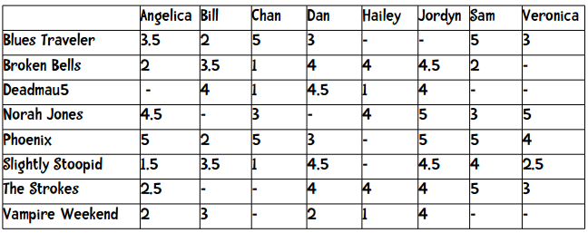
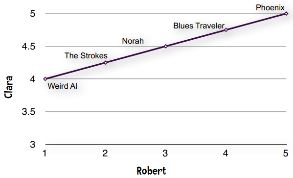
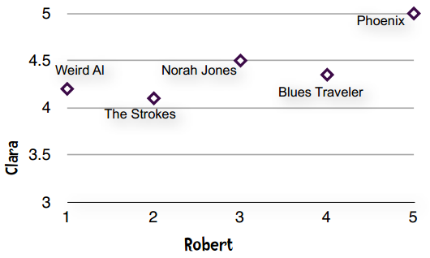
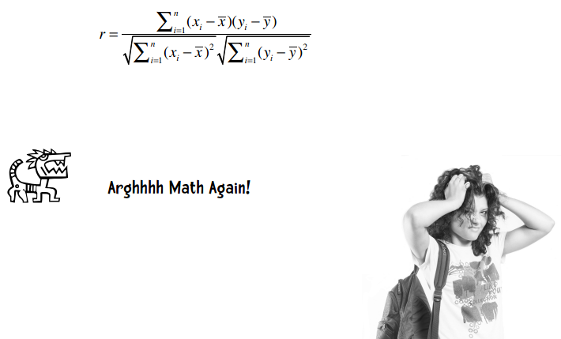
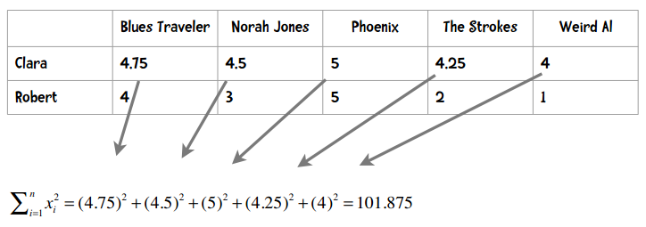

## 使用Python代码来表示数据（终于要开始编程了）

在Python中，我们可以用多种方式来描述上表中的数据，这里我选择Python的字典类型（或者称为关联数组、哈希表）。

注：本书的所有代码可以在[这里](https://github.com/yourtion/DataminingGuideBook-Codes)找到。

```python
users = {"Angelica": {"Blues Traveler": 3.5, "Broken Bells": 2.0, "Norah Jones": 4.5, "Phoenix": 5.0, "Slightly Stoopid": 1.5, "The Strokes": 2.5, "Vampire Weekend": 2.0},
         "Bill":{"Blues Traveler": 2.0, "Broken Bells": 3.5, "Deadmau5": 4.0, "Phoenix": 2.0, "Slightly Stoopid": 3.5, "Vampire Weekend": 3.0},
         "Chan": {"Blues Traveler": 5.0, "Broken Bells": 1.0, "Deadmau5": 1.0, "Norah Jones": 3.0, "Phoenix": 5, "Slightly Stoopid": 1.0},
         "Dan": {"Blues Traveler": 3.0, "Broken Bells": 4.0, "Deadmau5": 4.5, "Phoenix": 3.0, "Slightly Stoopid": 4.5, "The Strokes": 4.0, "Vampire Weekend": 2.0},
         "Hailey": {"Broken Bells": 4.0, "Deadmau5": 1.0, "Norah Jones": 4.0, "The Strokes": 4.0, "Vampire Weekend": 1.0},
         "Jordyn":  {"Broken Bells": 4.5, "Deadmau5": 4.0, "Norah Jones": 5.0, "Phoenix": 5.0, "Slightly Stoopid": 4.5, "The Strokes": 4.0, "Vampire Weekend": 4.0},
         "Sam": {"Blues Traveler": 5.0, "Broken Bells": 2.0, "Norah Jones": 3.0, "Phoenix": 5.0, "Slightly Stoopid": 4.0, "The Strokes": 5.0},
         "Veronica": {"Blues Traveler": 3.0, "Norah Jones": 5.0, "Phoenix": 4.0, "Slightly Stoopid": 2.5, "The Strokes": 3.0}
        }
```

我们可以用以下方式来获取某个用户的评分：

```python
>>> users["Veronica"]
{"Blues Traveler": 3.0, "Norah Jones": 5.0, "Phoenix": 4.0, "Slightly Stoopid": 2.5, "The Strokes": 3.0}
>>>
```

### 计算曼哈顿距离

```python
def manhattan(rating1, rating2):
    """计算曼哈顿距离。rating1和rating2参数中存储的数据格式均为
    {'The Strokes': 3.0, 'Slightly Stoopid': 2.5}"""
    distance = 0
    for key in rating1:
        if key in rating2:
            distance += abs(rating1[key] - rating2[key])
    return distance
```

我们可以做一下测试：

```python
>>> manhattan(users['Hailey'], users['Veronica'])
2.0
>>> manhattan(users['Hailey'], users['Jordyn'])
7.5
>>>
```

下面我们编写一个函数来找出距离最近的用户（其实该函数会返回一个用户列表，按距离排序）：

```python
def computeNearestNeighbor(username, users):
    """计算所有用户至username用户的距离，倒序排列并返回结果列表"""
    distances = []
    for user in users:
        if user != username:
            distance = manhattan(users[user], users[username])
            distances.append((distance, user))
    # 按距离排序——距离近的排在前面
    distances.sort()
    return distances
```

简单测试一下：

```python
>>> computeNearestNeighbor("Hailey", users)
[(2.0, 'Veronica'), (4.0, 'Chan'), (4.0, 'Sam'), (4.5, 'Dan'), (5.0, 'Angelica'), (5.5, 'Bill'), (7.5, 'Jordyn')]
```

最后，我们结合以上内容来进行推荐。假设我想为Hailey做推荐，这里我找到了离他距离最近的用户Veronica。然后，我会找到出Veronica评价过但Hailey没有评价的乐队，并假设Hailey对这些陌生乐队的评价会和Veronica相近。比如，Hailey没有评价过Phoenix乐队，而Veronica对这个乐队打出了4分，所以我们认为Hailey也会喜欢这支乐队。下面的函数就实现了这一逻辑：

```python
def recommend(username, users):
    """返回推荐结果列表"""
    # 找到距离最近的用户
    nearest = computeNearestNeighbor(username, users)[0][1]
    recommendations = []
    # 找出这位用户评价过、但自己未曾评价的乐队
    neighborRatings = users[nearest]
    userRatings = users[username]
    for artist in neighborRatings:
        if not artist in userRatings:
            recommendations.append((artist, neighborRatings[artist]))
    # 按照评分进行排序
    return sorted(recommendations, key=lambda artistTuple: artistTuple[1], reverse = True)
```

下面我们就可以用它来为Hailey做推荐了：

```python
>>> recommend('Hailey', users)
[('Phoenix', 4.0), ('Blues Traveler', 3.0), ('Slightly Stoopid', 2.5)]
```

运行结果和我们的预期相符。我们看可以看到，和Hailey距离最近的用户是Veronica，Veronica对Phoenix乐队打了4分。我们再试试其他人：

```python
>>> recommend('Chan', users)
[('The Strokes', 4.0), ('Vampire Weekend', 1.0)]
>>> recommend('Sam', users)
[('Deadmau5', 1.0)]
```

我们可以猜想Chan会喜欢The Strokes乐队，而Sam不会太欣赏Deadmau5。

```python
>>> recommend('Angelica', users)
[]
```

对于Angelica，我们得到了空的返回值，也就是说我们无法对其进行推荐。让我们看看是哪里有问题：

```python
>>> computeNearestNeighbor('Angelica', users)
[(3.5, 'Veronica'), (4.5, 'Chan'), (5.0, 'Hailey'), (8.0, 'Sam'), (9.0, 'Bill'), (9.0, 'Dan'), (9.5, 'Jordyn')]
```

Angelica最相似的用户是Veronica，让我们回头看看数据：



我们可以看到，Veronica评价过的乐队，Angelica也都评价过了，所以我们没有推荐。

之后，我们会讨论如何解决这一问题。

**作业：实现一个计算闵可夫斯基距离的函数，并在计算用户距离时使用它。**

```python
def minkowski(rating1, rating2, r):
    distance = 0
    for key in rating1:
        if key in rating2:
            distance += pow(abs(rating1[key] - rating2[key]), r)
    return pow(distance, 1.0 / r)

# 修改computeNearestNeighbor函数中的一行
distance = minkowski(users[user], users[username], 2)
# 这里2表示使用欧几里得距离
```

### 用户的问题

让我们仔细看看用户对乐队的评分，可以发现每个用户的打分标准非常不同：

* Bill没有打出极端的分数，都在2至4分之间；
* Jordyn似乎喜欢所有的乐队，打分都在4至5之间；
* Hailey是一个有趣的人，他的分数不是1就是4。

那么，如何比较这些用户呢？比如Hailey的4分相当于Jordan的4分还是5分呢？我觉得更接近5分。这样一来就会影响到推荐系统的准确性了。


* 左：我非常喜欢Broken Bells乐队，所以我给他们打4分！
* 右：Broken Bells乐队还可以，我打4分。

### 皮尔逊相关系数

解决方法之一是使用皮尔逊相关系数。简单起见，我们先看下面的数据（和之前的数据不同）：


这种现象在数据挖掘领域称为“分数膨胀”。Clara最低给了4分——她所有的打分都在4至5分之间。我们将它绘制成图表：



**一条直线——完全吻合！！！**

直线即表示Clara和Robert的偏好完全一致。他们都认为Phoenix是最好的乐队，然后是Blues Traveler、Norah Jones。如果Clara和Robert的意见不一致，那么落在直线上的点就越少。

**意见基本一致的情形**



**意见不太一致的情形**


所以从图表上理解，意见相一致表现为一条直线。皮尔逊相关系数用于衡量两个变量之间的相关性（这里的两个变量指的是Clara和Robert），它的值在-1至1之间，1表示完全吻合，-1表示完全相悖。从直观上理解，最开始的那条直线皮尔逊相关系数为1，第二张是0.91，第三张是0.81。因此我们利用这一点来找到相似的用户。

皮尔逊相关系数的计算公式是：



这里我说说自己的经历。我大学读的是现代音乐艺术，课程包括芭蕾、现代舞、服装设计等，没有任何数学课程。我高中读的是男子学校，学习了管道工程和汽车维修，只懂得很基础的数学知识。不知是因为我的学科背景，还是习惯于用直觉来思考，当我遇到这样的数学公式时会习惯性地跳过，继续读下面的文字。如果你和我一样，我强烈建议你与这种惰性抗争，试着去理解这些公式。它们虽然看起来很复杂，但还是能够被常人所理解的。

上面的公式除了看起来比较复杂，另一个问题是要获得计算结果必须对数据做多次遍历。好在我们有另外一个公式，能够计算皮尔逊相关系数的近似值：


这个公式虽然看起来更加复杂，而且其计算结果会不太稳定，有一定误差存在，但它最大的优点是，用代码实现的时候可以只遍历一次数据，我们会在下文看到。首先，我们将这个公式做一个分解，计算下面这个表达式的值：


对于Clara和Robert，我们可以得到：


很简单把？下面我们计算这个公式：


Clara的总评分是22.5， Robert是15，他们评价了5支乐队，因此：


所以，那个巨型公式的分子就是70 - 67.5 = 2.5。

下面我们来看分母：


首先：



我们已经计算过Clara的总评分是22.5，它的平方是506.25，除以乐队的数量5，得到101.25。综合得到：


对于Robert，我们用同样的方法计算：


最后得到：


因此，1表示Clara和Robert的偏好完全吻合。

**先休息一下吧**


**计算皮尔逊相关系数的代码**

```python
from math import sqrt

def pearson(rating1, rating2):
    sum_xy = 0
    sum_x = 0
    sum_y = 0
    sum_x2 = 0
    sum_y2 = 0
    n = 0
    for key in rating1:
        if key in rating2:
            n += 1
            x = rating1[key]
            y = rating2[key]
            sum_xy += x * y
            sum_x += x
            sum_y += y
            sum_x2 += pow(x, 2)
            sum_y2 += pow(y, 2)
    # 计算分母
    denominator = sqrt(sum_x2 - pow(sum_x, 2) / n) * sqrt(sum_y2 - pow(sum_y, 2) / n)
    if denominator == 0:
        return 0
    else:
        return (sum_xy - (sum_x * sum_y) / n) / denominator
```

测试一下：

```python
>>> pearson(users['Angelica'], users['Bill'])
-0.9040534990682699
>>> pearson(users['Angelica'], users['Hailey'])
0.42008402520840293
>>> pearson(users['Angelica'], users['Jordyn'])
0.7639748605475432
```
