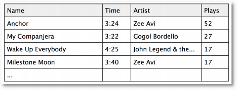

## 显式评价

用户的评价类型可以分为显式评价和隐式评价。显式评价指的是用户明确地给出对物品的评价，最常见的例子是Pandora和YouTube上的“喜欢”和“不喜欢”按钮：

以及亚马逊的星级系统：

## 隐式评价

所谓隐式评价，就是我们不让用户明确给出对物品的评价，而是通过观察他们的行为来获得偏好信息。示例之一是记录用户在纽约时报网上的点击记录。

经过几周的观察之后，我们就可以为用户刻画出一个合理的模型了——她不喜欢体育新闻，但关注科技新闻；如果用户连续看了两篇文章：《快速减肥方法》和《不反弹的减肥方式》，那她很可能正在减肥；如果她点击了iPhone的广告，就表明她或许对这款产品感兴趣。

试想一下，如果我们记录了用户在亚马逊上的操作记录，可以得出一些什么结论。你的首页上可能有这样的内容：

在这个示例中，亚马逊记录了用户的点击操作，因此它会知道浏览了Jupter Travel这本书的用户还浏览了Long Way Round这部DVD，其详细记录了演员伊万环球骑行的旅程。

因此，亚马逊就用这些信息来做出“看过还看过”的推荐。

另一种隐式评价是用户的实际购买记录，亚马逊也会用这些记录来进行“买过还买过”、以及“看过此商品的用户还买过”的推荐。

可能你会觉得“买过还买过”应该会给出一些不合理的推荐结果，但事实上它运作得很好。

再来看看iTunes上如何记录用户的行为：

首先，我将一首歌添加到了iTunes，这至少表明我对这首歌是感兴趣的。然后是播放次数，上表中我听了Anchor这首歌52次，说明我很喜欢；而那些只听了一次的歌曲则是我不喜欢的。

**头脑风暴**

> 你觉得让用户对物品进行显式评价会更精确吗？还是说通过观察用户对物品的行为（是否购买或播放次数）才更为准确？

> 显式评价：我叫吉姆，是一个素食主义者。我爱喝葡萄酒，喜欢在森林中漫步，在篝火旁阅读Chekov的书，喜欢观看法国电影，周六会去艺术博物馆逛逛，我还喜欢舒曼的钢琴曲。

> 隐式评价：我们在吉姆的口袋里发现了12打美国蓝带啤酒的收银条，以及冰激淋、披萨和甜甜圈的收银条。还有一些租借DVD的回执，有复仇者联盟、生化危机、拳霸等。
