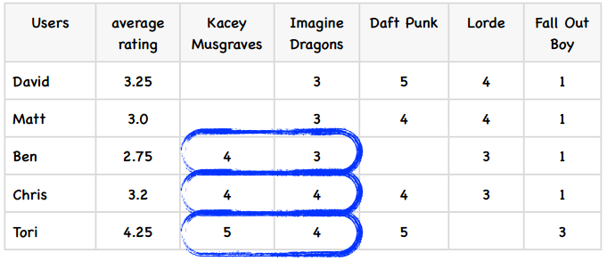
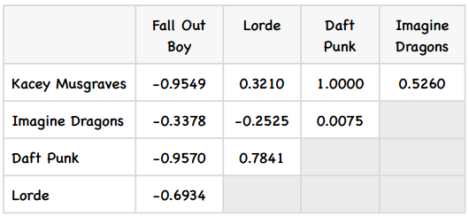
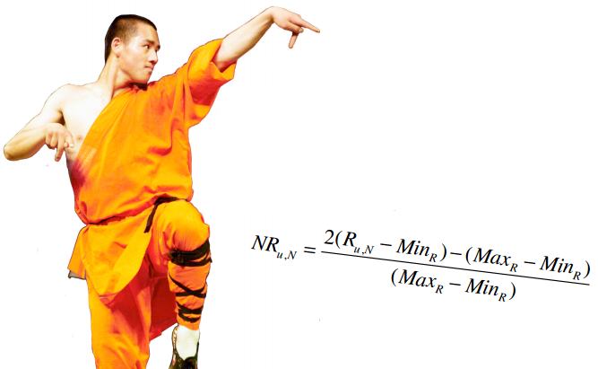
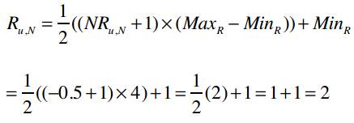

## 修正的余弦相似度

我们使用余弦相似度来计算两个物品的距离。我们在第二章中提过“分数膨胀”现象，因此我们会从用户的评价中减去他所有评价的均值，这就是修正的余弦相似度。


> 左：我喜欢Phoenix乐队，因此给他们打了5分。我不喜欢Passion，所以给了3分。

> 右：Phoenix很棒，我给4分。Passion Pit太糟糕了，必须给0分！


*U表示同时评价过物品i和j的用户集合*

这个公式来自于一篇影响深远的论文《[基于物品的协同过滤算法](http://www.grouplens.org/papers/pdf/www10_sarwar.pdf)》，由Badrul Sarwar等人合著。


上式表示将用户u对物品i的评价值减去用户u对所有物品的评价均值，从而得到修正后的评分。

s(i,j)表示物品i和j的相似度，分子表示将同时评价过物品i和j的用户的修正评分相乘并求和，分母则是对所有的物品的修正评分做一些汇总处理。

为了更好地演示修正的余弦相似度，我们举一个例子。下表是五个学生对五位歌手的评价：


首先，我们计算出每个用户的平均评分，这很简单：



下面，我们计算歌手之间的相似度，从Kacey Musgraves和Imagine Dragons开始。上图中我已经标出了同时评价过这两个歌手的用户，代入到公式中：


所以这两个歌手之间的修正余弦相似度为0.5260，我计算了其他一些歌手之间的相似度，其余的请读者们完成：


### 计算修正余弦相似度的Python代码

```python
# -*- coding: utf-8 -*-

from math import sqrt

users3 = {"David": {"Imagine Dragons": 3, "Daft Punk": 5,
                    "Lorde": 4, "Fall Out Boy": 1},
          "Matt": {"Imagine Dragons": 3, "Daft Punk": 4,
                   "Lorde": 4, "Fall Out Boy": 1},
          "Ben": {"Kacey Musgraves": 4, "Imagine Dragons": 3,
                  "Lorde": 3, "Fall Out Boy": 1},
          "Chris": {"Kacey Musgraves": 4, "Imagine Dragons": 4,
                    "Daft Punk": 4, "Lorde": 3, "Fall Out Boy": 1},
          "Tori": {"Kacey Musgraves": 5, "Imagine Dragons": 4,
                   "Daft Punk": 5, "Fall Out Boy": 3}}


def computeSimilarity(band1, band2, userRatings):
    averages = {}
    for (key, ratings) in userRatings.items():
        averages[key] = (float(sum(ratings.values())) / len(ratings.values()))
    
    num = 0 # 分子
    dem1 = 0 # 分母的第一部分
    dem2 = 0
    for (user, ratings) in userRatings.items():
        if band1 in ratings and band2 in ratings:
            avg = averages[user]
            num += (ratings[band1] - avg) * (ratings[band2] - avg)
            dem1 += (ratings[band1] - avg) ** 2
            dem2 += (ratings[band2] - avg) ** 2
    return num / (sqrt(dem1) * sqrt(dem2))

print(computeSimilarity('Kacey Musgraves', 'Lorde', users3))
print(computeSimilarity('Imagine Dragons', 'Lorde', users3))
print(computeSimilarity('Daft Punk', 'Lorde', users3))
```




> 这个矩阵看起来不错，那下面该如何使用它来做预测呢？比如我想知道David有多喜欢Kacey Musgraves？


p(u,i)表示我们会来预测用户u对物品i的评分，所以p(David, Kacey Musgraves)就表示我们将预测David会给Kacey打多少分。

N是一个物品的集合，有如下特性：

- 用户u对集合中的物品打过分
- 物品i和集合中的物品有相似度数据（即上文中的矩阵）

S<sub>i,N</sub>表示物品i和N的相似度，R<sub>u,N</sub>表示用户u对物品N的评分。

为了让公式的计算效果更佳，对物品的评价分值最好介于-1和1之间。

由于我们的评分系统是1至5星，所以需要使用一些运算将其转换到-1至1之间。



我们的音乐评分系统是5分制，Max<sub>R</sub>表示评分系统中的最高分（这里是5），Min<sub>R</sub>为最低分（这里是1），R<sub>u,N</sub>是用户u对物品N的评分，NR<sub>u,N</sub>则表示修正后的评分（即范围在-1和1之间）。

若已知NR<sub>u,N</sub>，求解R<sub>u,N</sub>的公式为：


比如一位用户给Fall Out Boy打了2分，那修正后的评分为：


反过来则是：



有了这个基础后，下面就让我们看看如何求解上文中的p(David, Kacey Musgraves)。

首先我们要修正David对各个物品的评分：


然后结合物品相似度矩阵，代入公式：


所以，我们预测出David对Kacey Musgraves的评分是0.753，将其转换到5星评价体系中：


最终的预测结果是4.506分。

**回顾**

* 修正的余弦相似度是一种基于模型的协同过滤算法。我们前面提过，这种算法的优势之一是扩展性好，对于大数据量而言，运算速度快、占用内存少。
* 用户的评价标准是不同的，比如喜欢一个歌手时有些人会打4分，有些打5分；不喜欢时有人会打3分，有些则会只给1分。修正的余弦相似度计算时会将用户对物品的评分减去用户所有评分的均值，从而解决这个问题。
