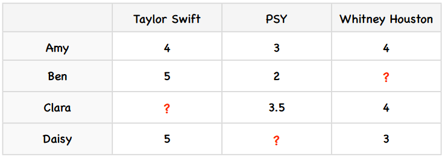
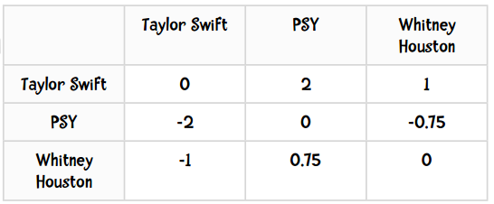
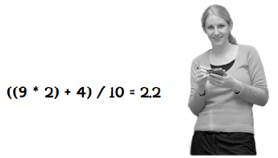
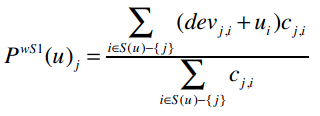

## Slope One算法

还有一种比较流行的基于物品的协同过滤算法，名为Slope One，它最大的优势是简单，因此易于实现。Slope One算法是在一篇名为《[Slope One：基于在线评分系统的协同过滤算法](http://www.daniel-lemire.com/fr/abstracts/SDM2005.html)》的论文中提出的，由Lemire和Machlachlan合著。这篇论文非常值得一读。

我们用一个简单的例子来了解这个算法。假设Amy给PSY打了3分，Whitney Houston打了4分；Ben给PSY打了4分。我们要预测Ben会给Whitney Houston打几分。用表格来描述这个问题即：

我们可以用以下逻辑来预测Ben对Whitney Houston的评分：由于Amy给Whitney Houston打的分数要比PSY的高一分，所以我们预测Ben也会给高一分，即给到5分。

其实还有其他形式的Slope One算法，比如加权的Slope One。我们说过Slope One的优势之一是简单，下面说的加权的Slope One看起来会有一些复杂，但是只要耐心地看下去，事情就会变得很清晰了。

你可以将Slope One分为两个步骤：首先需要计算出两两物品之间的差值（可以在夜间批量计算）。在上文的例子中，这个步骤就是得出Whitney Houston要比PSY高一分。第二步则是进行预测，比如一个新用户Ben来到了我们网站，他从未听过Whitney Houston的歌曲，我们想要预测他是否喜欢这位歌手。通过利用他评价过的歌手以及我们计算好的歌手之间的评分差值，就可以进行预测了。

### 第一步：计算差值

我们先为上述例子增加一些数据：

计算物品之间差异的公式是：

其中，card(S)表示S中有多少个元素；X表示所有评分值的集合；card(Sj,i(X))则表示同时评价过物品j和i的用户数。我们来考察PSY和Taylor Swift之间的差值，card(Sj,i(X))的值是2——因为有两个用户（Amy和Ben）同时对PSY和Taylor Swift打过分。分子uj-ui表示用户对j的评分减去对i的评分，代入公式得：

所以PSY和Taylor Swift的差异是2，即用户们给Taylor Swift的评分比PSY要平均高出两分。那Taylor Swift和PSY的差异呢？

**作业：计算其他物品之间的差值**

**头脑风暴**

试想我们的音乐站点有100万个用户对20万个歌手做评价。如果有一个新进的用户对10个歌手做了评价，我们是否需要重新计算20万×20万的差异数据，或是有其他更简单的方法？

答案是你不需要计算整个数据集，这正是Slope One的美妙之处。对于两个物品，我们只需记录同时评价过这对物品的用户数就可以了。比如说Taylor Swift和PSY的差值是2，是根据9位用户的评价计算的。当有一个新用户对Taylor Swift打了5分，PSY打了1分时，更新后的差值为：

### 第二步：使用加权的Slope One算法进行预测

好，现在我们有了物品之间的差异值，下面就用它来进行预测。这里我们将使用加权的Slope One算法来进行预测，用PWS1来表示，公式为：

其中：

PWS1(u)j表示我们将预测用户u对物品i的评分。比如PWS1(Ben)Whitney Houston表示Ben对Whitney Houston的预测评分。下面就让我们来求解这个问题。

首先来看分子：

表示遍历Ben评价过的所有歌手，除了Whitney Houston以外（也就是-{j}的意思）。

整个分子的意思是：对于Ben评价过的所有歌手（Whitney Houston除外），找出Whitney Houston和这些歌手之间的差值，并将差值加上Ben对这个歌手的评分。同时，我们要将这个结果乘以同时评价过两位歌手的用户数。

让我们分解开来看，先将Ben的评分情况和两两歌手之间的差异值展示如下：

1. Ben对Taylor Swift打了5分，也就是ui
2. Whitney Houston和Taylor Swift的差异是-1，即devj,i
3. devj,i + ui = 4
4. 共有两个用户（Amy和Daisy）同时对Taylor Swift和Whitney Houston做了评价，即cj,i = 2
5. 那么(devj,i + ui) cj,i = 4 × 2 = 8
6. Ben对PSY打了2分
7. Whitney Houston和PSY的差异是0.75
8. devj,i + ui = 2.75
9. 有两个用户同时评价了这两位歌手，因此(devj,i + ui) cj,i = 2.75 × 2 = 5.5
10. 分子：8 + 5.5 = 13.5
11. 分母：2 + 2 = 4
12. 预测评分：13.5 ÷ 4 = 3.375

