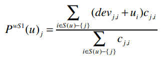

## 使用Python实现Slope One算法

我们将沿用第二章中编写的Python类，重复的代码我不在这里赘述。输入的数据是这样的：

```python
users2 = {"Amy": {"Taylor Swift": 4, "PSY": 3, "Whitney Houston": 4},
          "Ben": {"Taylor Swift": 5, "PSY": 2},
          "Clara": {"PSY": 3.5, "Whitney Houston": 4},
          "Daisy": {"Taylor Swift": 5, "Whitney Houston": 3}}
```

我们先来计算两两物品之间的差异，公式是：


计算后的输出结果应该如下表所示：


括号中的数值表示同时给这两个歌手评过分的用户数。

### 第一步

```python
def computeDeviations(self):
    # 获取每位用户的评分数据
    for ratings in self.data.values():
```

self.data是一个Python字典，它的values()方法可以获取所有键的值。比如上述代码在第一次迭代时，ratings变量的值为{"Taylor Swift": 4, "PSY": 3, "Whitney Houston": 4}。

### 第二步

```python
def computeDeviations(self):
    # 获取每位用户的评分数据
    for ratings in self.data.values():
        # 对于该用户的每个评分项（歌手、分数）
        for (item, rating) in ratings.items():
            self.frequencies.setdefault(item, {})
            self.deviations.setdefault(item, {})
```

在这个类的初始化方法中，我们需要对self.frequencies和self.deviations进行赋值：

```python
def __init__(self, data, k=1, metric='pearson', n=5):
    ...
    # 以下变量将用于Slope One算法
    self.frequencies = {}
    self.deviations = {}
```

Python字典的setdefault()方法接受两个参数，它的作用是：如果字典中不包含指定的键，则将其设为默认值；若存在，则返回其对应的值。

### 第三步

```python
def computeDeviations(self):
    # 获取每位用户的评分数据
    for ratings in self.data.values():
        # 对于该用户的每个评分项（歌手、分数）
        for (item, rating) in ratings.items():
            self.frequencies.setdefault(item, {})
            self.deviations.setdefault(item, {})
            # 再次遍历该用户的每个评分项
            for (item2, rating2) in ratings.items():
                if item != item2:
                    # 将评分的差异保存到变量中
                    self.frequencies[item].setdefault(item2, 0)
                    self.deviations[item].setdefault(item2, 0.0)
                    self.frequencies[item][item2] += 1
                    self.deviations[item][item2] += rating - rating2
```

还是用{"Taylor Swift": 4, "PSY": 3, "Whitney Houston": 4}举例，在第一次遍历中，外层循环item = "Taylor Swift"，rating = 4；内层循环item2 = "PSY"，rating2 = 3，因此最后一行代码是对self.deviations["Taylor Swift"]["PSY"]做+1的操作。

### 第四步

最后，我们便可计算出差异值：

```python
def computeDeviations(self):
    # 获取每位用户的评分数据
    for ratings in self.data.values():
        # 对于该用户的每个评分项（歌手、分数）
        for (item, rating) in ratings.items():
            self.frequencies.setdefault(item, {})
            self.deviations.setdefault(item, {})
            # 再次遍历该用户的每个评分项
            for (item2, rating2) in ratings.items():
                if item != item2:
                    # 将评分的差异保存到变量中
                    self.frequencies[item].setdefault(item2, 0)
                    self.deviations[item].setdefault(item2, 0.0)
                    self.frequencies[item][item2] += 1
                    self.deviations[item][item2] += rating - rating2

    for (item, ratings) in self.deviations.items():
        for item2 in ratings:
            ratings[item2] /= self.frequencies[item][item2]
```

完成了！仅仅用了18代码我们就实现了这个公式：


让我们测试一下：

```python
>>> r = Recommender()
>>> r.computeDeviations()
>>> r.deviations
{'PSY': {'Taylor Swift': -2.0, 'Whitney Houston': -0.75}, 'Taylor Swift': {'PSY': 2.0, 'Whitney Houston': 1.0}, 'Whitney Houston': {'PSY': 0.75, 'Taylor Swift': -1.0}}
```

结果和我们之前手工计算的一致：


**感谢[Bryan O'Sullivan](http://www.serpentine.com/blog/)，这里用Python实现的Slope One算法正是基于他的成果。**


### 加权的Slope One算法：推荐逻辑的实现



```python
def slopeOneRecommendations(self, userRatings):
    recommendations = {}
    frequencies = {}
    # 遍历目标用户的评分项（歌手、分数）
    for (userItem, userRating) in userRatings.items():
        # 对目标用户未评价的歌手进行计算
        for (diffItem, diffRatings) in self.deviations.items():
            if diffItem not in userRatings and userItem in self.deviations[diffItem]:
                freq = self.frequencies[diffItem][userItem]
                recommendations.setdefault(diffItem, 0.0)
                frequencies.setdefault(diffItem, 0)
                # 分子
                recommendations[diffItem] += (diffRatings[userItem] + userRating) * freq
                # 分母
                frequencies[diffItem] += freq

    recommendations = [(k, v / frequencies[k]) for (k, v) in recommendations.items()]
    # 排序并返回
    recommendations.sort(key=lambda artistTuple: artistTuple[1], reverse=True)
    return recommendations

>>> r.slopeOneRecommendations(users2['Ben'])
[('Whitney Houston', 3.375)]
```

### MovieLens数据集

让我们在另一个数据集上尝试一下Slope One算法。MovieLens数据集是由明尼苏达州大学的GroupLens研究项目收集的，是用户对电影的评分。这个数据集可以在[www.grouplens.org](http://www.grouplens.org/)下载，有三种大小，这里我使用的是最小的那个，包含了943位用户对1682部电影的评价，约10万条记录。我们一起来测试一下：

```python
>>> r = recommender(0)
>>> r.loadMovieLens('/Users/raz/Downloads/ml-100k/')
102625
>>> r.computeDeviations() # 大约需要50秒
>>> r.slopeOneRecommendations(r.data['25'])
[('Aiqing wansui (1994)', 5.674418604651163), ('Boys, Les (1997)', 5.523076923076923), ...]
```

**作业**

1. 看看Slope One的推荐结果是否靠谱：对数据集中的10部电影进行评分，得到的推荐结果是否是你喜欢的电影呢？
2. 实现修正的余弦相似度算法，比较一下两者的运算效率。
3. （较难）我的笔记本电脑有8G内存，在尝试用Slope One计算图书漂流站数据集时报内存溢出了。那个数据集中有27万本书，因此需要保存超过7300万条记录的Python字典。这个字典的数据是否很稀疏呢？修改算法，让它能够处理更多数据吧。


**祝贺大家学完第三章了**
