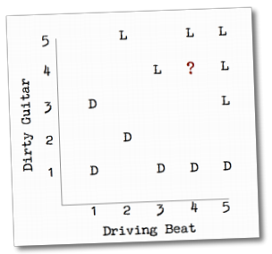
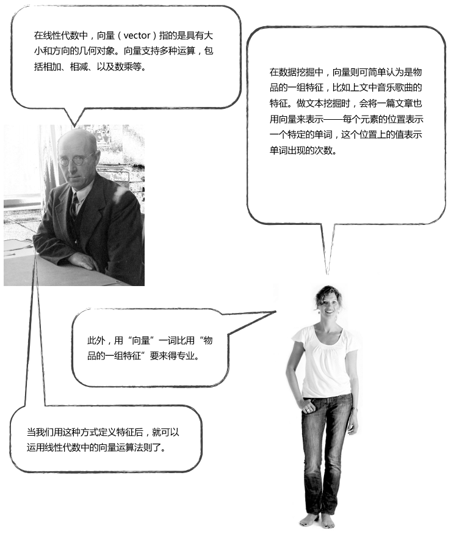
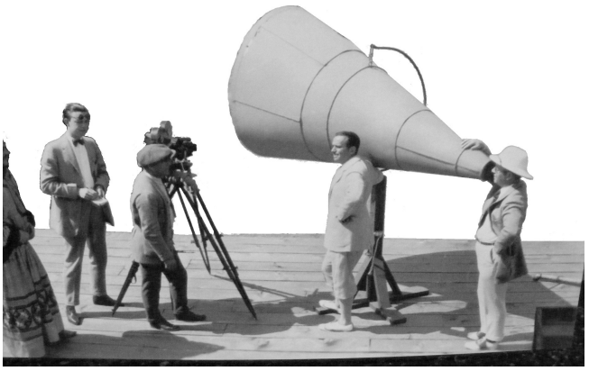

## 回到潘多拉

在潘多拉网站的示例中，我们用一个特征向量来表示一首歌曲，用以计算歌曲的相似度。

潘多拉网站同样允许用户对歌曲“赞”和“踩”，那我们要如何利用这些数据呢？

假设我们的歌曲有两个特征，重金属吉他（Dirty Guitar）和强烈的节奏感（Driving Beat），两种特征都在1到5分之间。

一位用户对5首歌曲做了“赞”的操作（图中的L），另外五首则“踩”了一下（图中的D）：



图中多了一个问号所表示的歌曲，你觉得用户会喜欢它还是不喜欢呢？

想必你也猜到了，因为这个问号离用户喜欢的歌曲距离较近。这一章接下来的篇幅都会用来讲述这种计算方法。

最明显的方式是找到问号歌曲最邻近的歌曲，因为它们之间相似度比较高，再根据用户是否喜欢这些邻近歌曲来判断他对问号歌曲的喜好。

### 使用Python实现最邻近分类算法

我们仍使用上文中的歌曲示例，用7个特征来标识10首歌曲：


使用Python代码来表示这些数据：

```python
music = {"Dr Dog/Fate": {"piano": 2.5, "vocals": 4, "beat": 3.5, "blues": 3, "guitar": 5, "backup vocals": 4, "rap": 1},
         "Phoenix/Lisztomania": {"piano": 2, "vocals": 5, "beat": 5, "blues": 3, "guitar": 2, "backup vocals": 1, "rap": 1},
         "Heartless Bastards/Out at Sea": {"piano": 1, "vocals": 5, "beat": 4, "blues": 2, "guitar": 4, "backup vocals": 1, "rap": 1},
         "Todd Snider/Don't Tempt Me": {"piano": 4, "vocals": 5, "beat": 4, "blues": 4, "guitar": 1, "backup vocals": 5, "rap": 1},
         "The Black Keys/Magic Potion": {"piano": 1, "vocals": 4, "beat": 5, "blues": 3.5, "guitar": 5, "backup vocals": 1, "rap": 1},
         "Glee Cast/Jessie's Girl": {"piano": 1, "vocals": 5, "beat": 3.5, "blues": 3, "guitar":4, "backup vocals": 5, "rap": 1},
         "La Roux/Bulletproof": {"piano": 5, "vocals": 5, "beat": 4, "blues": 2, "guitar": 1, "backup vocals": 1, "rap": 1},
         "Mike Posner": {"piano": 2.5, "vocals": 4, "beat": 4, "blues": 1, "guitar": 1, "backup vocals": 1, "rap": 1},
         "Black Eyed Peas/Rock That Body": {"piano": 2, "vocals": 5, "beat": 5, "blues": 1, "guitar": 2, "backup vocals": 2, "rap": 4},
         "Lady Gaga/Alejandro": {"piano": 1, "vocals": 5, "beat": 3, "blues": 2, "guitar": 1, "backup vocals": 2, "rap": 1}}
```

这样做虽然可行，但却比较繁琐，piano、vocals这样的键名需要重复很多次。

我们可以将其简化为向量，即Python中的数组类型：

```python
#
# 物品向量中的特征依次为：piano, vocals, beat, blues, guitar, backup vocals, rap
#
items = {"Dr Dog/Fate": [2.5, 4, 3.5, 3, 5, 4, 1],
         "Phoenix/Lisztomania": [2, 5, 5, 3, 2, 1, 1],
         "Heartless Bastards/Out": [1, 5, 4, 2, 4, 1, 1],
         "Todd Snider/Don't Tempt Me": [4, 5, 4, 4, 1, 5, 1],
         "The Black Keys/Magic Potion": [1, 4, 5, 3.5, 5, 1, 1],
         "Glee Cast/Jessie's Girl": [1, 5, 3.5, 3, 4, 5, 1],
         "La Roux/Bulletproof": [5, 5, 4, 2, 1, 1, 1],
         "Mike Posner": [2.5, 4, 4, 1, 1, 1, 1],
         "Black Eyed Peas/Rock That Body": [2, 5, 5, 1, 2, 2, 4],
         "Lady Gaga/Alejandro": [1, 5, 3, 2, 1, 2, 1]}
```



接下来我还需要将用户“赞”和“踩”的数据也用Python代码表示出来。

由于用户并不会对所有的歌曲都做这些操作，所以我用嵌套的字典来表示：

```python
users = {"Angelica": {"Dr Dog/Fate": "L",
                      "Phoenix/Lisztomania": "L",
                      "Heartless Bastards/Out at Sea": "D",
                      "Todd Snider/Don't Tempt Me": "D",
                      "The Black Keys/Magic Potion": "D",
                      "Glee Cast/Jessie's Girl": "L",
                      "La Roux/Bulletproof": "D",
                      "Mike Posner": "D",
                      "Black Eyed Peas/Rock That Body": "D",
                      "Lady Gaga/Alejandro": "L"},
         "Bill": {"Dr Dog/Fate": "L",
                  "Phoenix/Lisztomania": "L",
                  "Heartless Bastards/Out at Sea": "L",
                  "Todd Snider/Don't Tempt Me": "D",
                  "The Black Keys/Magic Potion": "L",
                  "Glee Cast/Jessie's Girl": "D",
                  "La Roux/Bulletproof": "D",
                  "Mike Posner": "D",
                  "Black Eyed Peas/Rock That Body": "D",
                  "Lady Gaga/Alejandro": "D"}}
```

这里使用L和D两个字母来表示喜欢和不喜欢，当然你也可以用其他方式，比如0和1等。

对于新的向量格式，我们需要对曼哈顿距离函数和邻近物品函数做一些调整：

```python
def manhattan(vector1, vector2):
    distance = 0
    total = 0
    n = len(vector1)
    for i in range(n):
        distance += abs(vector1[i] - vector2[i])
    return distance
    
def computeNearestNeighbor(itemName, itemVector, items):
    """按照距离排序，返回邻近物品列表"""
    distances = []
    for otherItem in items:
        if otherItem != itemName:
            distance = manhattan(itemVector, items[otherItem])
            distances.append((distance, otherItem))
    # 最近的排在前面
    distances.sort()
    return distances
```

最后，我需要建立一个分类函数，用来预测用户对一个新物品的喜好，如：

```
"Chris Cagle/I Breathe In. I Breathe Out" [1, 5, 2.5, 1, 1, 5, 1]
```

这个函数会先计算出与这个物品距离最近的物品，然后找到用户对这个最近物品的评价，以此作为新物品的预测值。

下面是一个最简单的分类函数：

```python
def classify(user, itemName, itemVector):
    nearest = computeNearestNeighbor(itemName, itemVector, items)[0][1]
    rating = users[user][nearest]
    return rating
```

让我们试用一下：

```python
>>> classify('Angelica', 'Chris Cagle/I Breathe In. I Breathe Out', [1, 5, 2.5, 1, 1, 5, 1])
'L'
```

我们认为她会喜欢这首歌曲！为什么呢？

```python
>>> computeNearestNeighbor('Chris Cagle/I Breathe In. I Breathe Out', [1, 5, 2.5, 1, 1, 5, 1], items)
[(4.5, 'Lady Gaga/Alejandro'), (6.0, "Glee Cast/Jessie's Girl"), (7.5, "Todd Snider/Don't Tempt Me"), (8.0, 'Mike Posner'), (9.5, 'Heartless Bastards/Out'), (10.5, 'Black Eyed Peas/Rock That Body'), (10.5, 'Dr Dog/Fate'), (10.5, 'La Roux/Bulletproof'), (10.5, 'Phoenix/Lisztomania'), (14.0, 'The Black Keys/Magic Potion')]
```

可以看到，距离I Breathe In最近的歌曲是Alejandro，并且Angelica是喜欢这首歌曲的，所以我们预测她也会喜欢I Breathe In。

其实我们做的是一个分类器，将歌曲分为了用户喜欢和不喜欢两个类别。

**号外，号外！我们编写了一个分类器！**



**分类器是指通过物品特征来判断它应该属于哪个组或类别的程序！**

分类器程序会基于一组已经做过分类的物品进行学习，从而判断新物品的所属类别。

在上面的例子中，我们知道Angelica喜欢和不喜欢的歌曲，然后据此判断她是否会喜欢Chris Cagle的歌。

1. 在Angelica评价过的歌曲中找到距离Chris Cagle最近的歌曲，即Laydy Gaga的Alejandro；
2. 由于Angelica是喜欢Alejandro这首歌的，所以我们预测她也会喜欢Chris Cagle的Breathe In, Breathe Out。

分类器的应用范围很广，以下是一些示例：

**推特情感分类**

很多人在对推特中的文字消息进行情感分类（积极的、消极的），可以有很多用途，如Axe发布了一款新的腋下除臭剂，通过推文就能知道用户是否满意。这里用到的物品特征是文字信息。

**人脸识别**

现在有些手机应用可以识别出照片里你的朋友们，这项技术也可用于监控录像中的人脸识别。不同的识别技术细节可能不同，但都会用到诸如五官的大小和相对距离等信息。

**政治拉票**

通过将目标选民分为“爱凑热闹”、“很有主见”、“家庭为重”等类型，来进行有针对性的拉票活动。

**市场细分**

这和上个例子有点像，与其花费巨额广告费向不可能购买维加斯公寓的人进行宣传，不如从人群中识别出潜在客户，缩小宣传范围。最好能再对目标群体进行细分，进一步定制广告内容。

**个人健康助理**

如今人们越来越关注自身，我们可以购买到像Nike健身手环这样的产品，而Intel等公司也在研制一种智能家居，可以在你行走时称出你的重量，记录你的行动轨迹，并给出健康提示。

有些专家还预言未来我们会穿戴各种便携式设备，收集我们的生活信息，并加以分类。

**其他**

* 识别恐怖分子
* 来信分类（重要的、一般的、垃圾邮件）
* 预测医疗费用
* 识别金融诈骗

