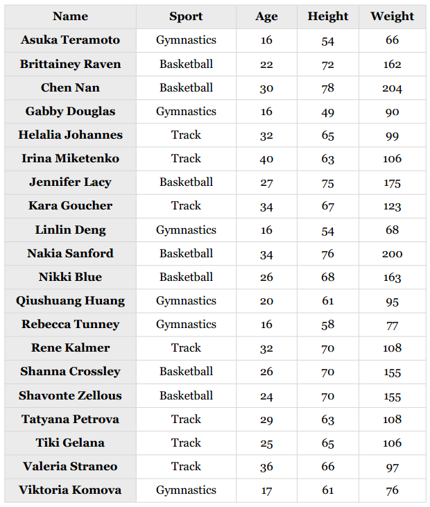
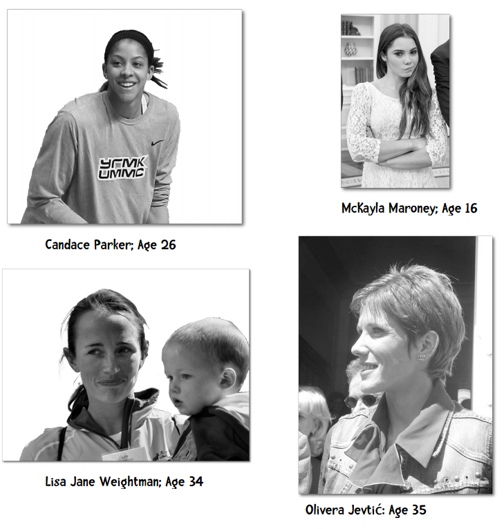
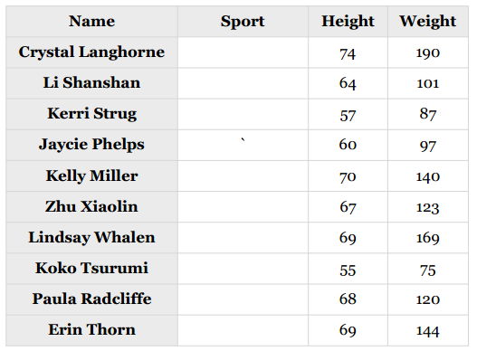

## 她是从事什么运动的？

让我们来为之后的几章做一个预热，先看一个较为简单的例子——根据女运动员的身高和体重来判断她们是从事什么运动项目的。

下表是原始数据：

这里列出的是2008和2012奥运会上排名靠前的二十位女运动员。

篮球运动员参加了WNBA；田径运动员则完成了2012年奥运会的马拉松赛。虽然数据量很小，但我们仍可以对其应用一些数据挖掘算法。

你可以看到上表中列出了运动员的年龄，光凭这一信息就能进行一些预测了。

比如，以下运动员会是哪个项目的呢？

### 答案

Candace Parker是篮球运动员，McKayla Maroney是美国女子体操队的一员，Olivera Jevtic是塞尔维亚的一名长跑运动员，Lisa Jane Weightman则是澳大利亚的长跑运动员。

看，我们刚刚就进行了一次分类——通过运动员的年龄特征来识别她们参与的体育项目。

**头脑风暴**

假设我想通过运动员的身高和体重来预测她所从事的运动，数据集只有两人：Nakia Sanford是篮球运动员，身高6尺4寸（76英寸，1.93米），体重200磅（90公斤）；Sarah Beale是橄榄球运动员，身高5尺10寸（70英寸，1.78米），体重190磅（86公斤）。

我想知道Catherine Spencer是从事哪项运动的，她的身高是5尺10寸，重200磅，如何预测呢？

如果你认为她是橄榄球运动员，那么你猜对了。但是，如果用曼哈顿距离来进行计算，Catherine和Nakia的距离是6，和Sarah的距离是10，那应该预测她是篮球运动员才对。

我们之前是否学过一个方法，能让距离计算更为准确呢？

*没错，就是修正的标准分！*

### 测试数据

下表是我们需要进行预测的运动员列表，一起来做分类器吧！

