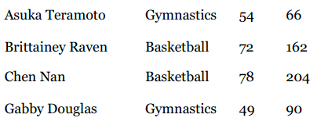

## Python编码

这次我们不将数据直接写在Python代码中，而是放到两个文本文件里：athletesTrainingSet.txt和athletesTestSet.txt。

我会使用第一个文件中的数据来训练分类器，然后使用测试文件里的数据来进行评价。

文件格式大致如下：



文件中的每一行是一条完整的记录，字段使用制表符分隔。

我要使用运动员的身高体重数据来预测她所从事的运动项目，也就是用第三、四列的数据来预测第二列的数据。

运动员的姓名不会使用到，我们既不能通过运动员的姓名得知她参与的项目，也不会通过身高体重来预测运动员的姓名。


> 你好，你有五英尺高，150磅重，莫非你的名字是Clara Coleman？

当然，名字也有它的用处，我们可以用它来解释分类器的预测结果：“我们认为Amelia Pond是一名体操运动员，因为她的身高体重和另一名体操运动员Gabby Douglas很接近。”

为了让我们的Python代码更具一般性，并不只适用于这一种数据集，我会为每一列数据增加一个列名，如：


所有被标记为comment的列都会被分类器忽略；标记为class的列表示物品所属分类；不定个数的num列则表示物品的特征。

**头脑风暴**

我们在Python中应该如何表示这些数据呢？以下是一些可能性：

```python
# 1
{'Asuka Termoto': ('Gymnastics', [54, 66]),
 'Brittainey Raven': ('Basketball', [72, 162]), ...}
```

这种方式使用了运动员的姓名作为键，而我们说过分类器程序根本不会使用到姓名，所以不合理。

```python
# 2
[['Asuka Termoto', 'Gymnastics', 54, 66],
 ['Brittainey Raven', 'Basketball', 72, 162], ...]
```

这种方式看起来不错，它直接反映了文件的格式。由于我们需要遍历文件的数据，所以使用列表类型（list）是合理的。

```python
# 3
[('Gymnastics', [54, 66], ['Asuka Termoto']),
 ('Basketball', [72, 162], ['Brittainey Raven']), ...]
```

这是我最认同的表示方式，因为它将不同类型的数据区别开来了，依次是分类、特征、备注。这里备注可能有多个，所以也用了一个列表来表示。

以下是读取数据文件并转换成上述格式的函数：

```python
class Classifier:

    def __init__(self, filename):

        self.medianAndDeviation = []
        
        # 读取文件
        f = open(filename)
        lines = f.readlines()
        f.close()
        self.format = lines[0].strip().split('\t')
        self.data = []
        for line in lines[1:]:
            fields = line.strip().split('\t')
            ignore = []
            vector = []
            for i in range(len(fields)):
                if self.format[i] == 'num':
                    vector.append(int(fields[i]))
                elif self.format[i] == 'comment':
                    ignore.append(fields[i])
                elif self.format[i] == 'class':
                    classification = fields[i]
            self.data.append((classification, vector, ignore))
```

**动手实践**

在计算修正的标准分之前，我们需要编写获取中位数和计算绝对偏差的函数，尝试实现这两个函数：

```python
>>> heights = [54, 72, 78, 49, 65, 63, 75, 67, 54]
>>> median = classifier.getMedian(heights)
>>> median
65
>>> asd = classifier.getAbsoluteStandardDeviation(heights, median)
>>> asd
8.0
```

### 关于断言

通常我们会将一个大的算法拆分成几个小的组件，并为每个组件编写一些单元测试，从而确保它能正常工作。

很多时候，我们会先写单元测试，再写正式的代码。在我提供的[模板代码](https://github.com/yourtion/DataminingGuideBook-Codes/tree/master/chapter-4/testMedianAndASD.py)中已经编写了一些单元测试

摘录如下：

```python
def unitTest():
    list1 = [54, 72, 78, 49, 65, 63, 75, 67, 54]
    classifier = Classifier('athletesTrainingSet.txt')
    m1 = classifier.getMedian(list1)
    assert(round(m1, 3) == 65)
    ...
    print("getMedian和getAbsoluteStandardDeviation均能正常工作")
```

你需要完成的geMedian函数的模板是：

```python
def getMedian(self, alist):
    """返回中位数"""
    
    """请在此处编写代码"""
    return 0
```

这个模板函数返回的是0，你需要编写代码来返回列表的中位数。

比如单元测试中我传入了以下列表：

```python
[54, 72, 78, 49, 65, 63, 75, 67, 54]
```

assert（断言）表示函数的返回值应该是65。如果所有的单元测试都能通过，则报告以下信息：

```
getMedian和getAbsoluteStandardDeviation均能正常工作
```

否则，则抛出以下异常：

```
File "testMedianAndASD.py", line 78, in unitTest
    assert(round(m1, 3) == 65)
AssertError
```

断言在单元测试中是很常用的。

> 将大型代码拆分成一个个小的部分，并为每个部分编写单元测试，这一点是很重要的。如果没有单元测试，你将无法知道自己是否正确完成了所有任务，以及未来的某个修改是否会导致你的程序不可用。--- Peter Norvig


### 答案

```python
def getMedian(self, alist):
    """返回中位数"""
    if alist == []:
        return []
    blist = sorted(alist)
    length = len(alist)
    if length % 2 == 1:
        # 列表有奇数个元素，返回中间的元素
        return blist[int(((length + 1) / 2) -  1)]
    else:
        # 列表有偶数个元素，返回中间两个元素的均值
        v1 = blist[int(length / 2)]
        v2 = blist[(int(length / 2) - 1)]
        return (v1 + v2) / 2.0

def getAbsoluteStandardDeviation(self, alist, median):
    """计算绝对偏差"""
    sum = 0
    for item in alist:
        sum += abs(item - median)
    return sum / len(alist)
```

可以看到，getMedian函数对列表进行了排序，由于数据量并不大，所以这种方式是可以接受的。

如果要对代码进行优化，我们可以使用[选择算法](http://en.wikipedia.org/wiki/Selection_algorithm)。

现在，我们已经将数据从athletesTrainingSet.txt读取出来，并保存为以下形式：

```python
[('Gymnastics', [54, 66], ['Asuka Teramoto']),
 ('Basketball', [72, 162], ['Brittainey Raven']),
 ('Basketball', [78, 204], ['Chen Nan']),
 ('Gymnastics', [49, 90], ['Gabby Douglas']), ...]
```

我们需要对向量中的数据进行标准化，变成以下结果：

```python
[('Gymnastics', [-1.93277, -1.21842], ['Asuka Teramoto']),
 ('Basketball', [1.09243, 1.63447], ['Brittainey Raven']),
 ('Basketball', [2.10084, 2.88261], ['Chen Nan']),
 ('Gymnastics', [-2.7731, -0.50520]),
 ('Track', [-0.08403, -0.23774], ['Helalia Johannes']),
 ('Track', [-0.42017, -0.02972], ['Irina Miketenko']), ...]
```

在init方法中，添加标准化过程：

```python
# 获取向量的长度
self.vlen = len(self.data[0][1])
# 标准化
for i in range(self.vlen):
    self.normalizeColumn(i)
```

在for循环中逐列进行标准化，即第一次会标准化身高，第二次标准化体重。

**动手实践** 下载[normalizeColumnTemplate.py](https://github.com/yourtion/DataminingGuideBook-Codes/tree/master/chapter-4/normalizeColumnTemplate.py)文件，编写normalizeColumn方法。

### 答案

```python
def normalizeColumn(self, columnNumber):
    """标准化self.data中的第columnNumber列"""
    # 将该列的所有值提取到一个列表中
    col = [v[1][columnNumber] for v in self.data]
    median = self.getMedian(col)
    asd = self.getAbsoluteStandardDeviation(col, median)
    #print("Median: %f   ASD = %f" % (median, asd))
    self.medianAndDeviation.append((median, asd))
    for v in self.data:
        v[1][columnNumber] = (v[1][columnNumber] - median) / asd
```

可以看到，我将计算得到的中位数和绝对偏差保存在了medianAndDeviation变量中，因为我们会用它来标准化需要预测的向量。

比如，我要预测Kelly Miller的运动项目，她身高5尺10寸（70英寸），重140磅，即原始向量为[70, 140]，需要先进行标准化。

我们计算得到的meanAndDeviation为：

```python
[(65.5, 5.95), (107.0, 33.65)]
```

它表示向量中第一元素的中位数为65.5，绝对偏差为5.95；第二个元素的中位数为107.0，绝对偏差33.65。

现在我们就利用这组数据将[70, 140]进行标准化。第一个元素的标准分数是：


第二个元素为：


以下是实现它的Python代码：

```python
def normalizeVector(self, v):
    """我们已保存了每列的中位数和绝对偏差，现用它来标准化向量v"""
    vector = list(v)
    for i in range(len(vector)):
        (median, asd) = self.medianAndDeviation[i]
        vector[i] = (vector[i] - median) / asd
    return vector
```

最后，我们要编写分类函数，用来预测运动员的项目：

```python
classifier.classify([70, 140])
```

在我们的实现中，classify函数只是nearestNeighbor的一层包装：

```python
def classify(self, itemVector):
    """预测itemVector的分类"""
    return self.nearestNeighbor(self.normalizeVector(itemVector))[1][0]
```

**动手实践** 实现nearestNeighbor函数。

### 答案

```python
def manhattan(self, vector1, vector2):
    """计算曼哈顿距离"""
    return sum(map(lambda v1, v2: abs(v1 - v2), vector1, vector2))

def nearestNeighbor(self, itemVector):
    """返回itemVector的近邻"""
    return min([(self.manhattan(itemVector, item[1]), item)
                for item in self.data])
```

**好了，我们用200多行代码实现了近邻分类器！**


在完整的[示例代码](https://github.com/yourtion/DataminingGuideBook-Codes/tree/master/chapter-4/nearestNeighborClassifier.py#L188)中，我提供了一个test函数，它可以对分类器程序的准确性做一个评价。

比如用它来评价上面实现的分类器：

```
-         Track  Aly Raisman  Gymnastics  62  115
+    Basketball  Crystal Langhorne  Basketball  74  190
+    Basketball  Diana Taurasi  Basketball  72  163
...
+         Track  Xueqin Wang  Track 64  110
+         Track  Zhu Xiaolin  Track 67  123

80.00% correct
```

可以看到，这个分类器的准确率是80%。它对篮球运动员的预测很准确，但在预测田径和体操运动员时出现了4个失误。

### 鸢尾花数据集

我们可以用鸢尾花数据集做测试，这个数据集在数据挖掘领域是比较有名的。

它是20世纪30年代Ronald Fisher对三种鸢尾花的50个样本做的测量数据（萼片和花瓣）。


> Ronald Fisher是一名伟大的科学家。他对统计学做出了革命性的改进，Richard Dawkins称他为“继达尔文后最伟大生物学家。”


鸢尾花数据集可以在这里[irisTrainingSet](https://raw.githubusercontent.com/yourtion/DataminingGuideBook-Codes/master/chapter-4/irisTrainingSet.data)、[irisTestSet](https://raw.githubusercontent.com/yourtion/DataminingGuideBook-Codes/master/chapter-4/irisTestSet.data)找到，你可以测试你的算法，并问自己一些问题：标准化让结果更正确了吗？训练集中的数据量越多越好吗？用欧几里得距离来算会怎样？

*记住* 所有的学习过程都是在你自己的脑中进行的，你付出的努力越多，学到的也就越多。

鸢尾花数据集的格式如下，我们要预测的是Species这一列：


训练集中有120条数据，测试集中有30条，两者没有交集。

测试结果如何呢？

```python
>>> test('irisTrainingSet.data', 'iristestSet.data')
93.33% correct
```

这又一次证明我们的分类算法是简单有效的。

有趣的是，如果不对数据进行标准化，它的准确率将达到100%。这个现象我们会在后续的章节中讨论。
