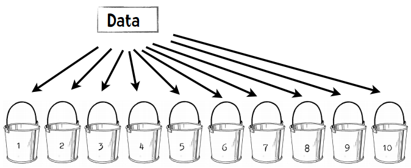

## 效果评估算法和kNN

让我们回到上一章中运动项目的例子。


在那个例子中，我们编写了一个分类器程序，通过运动员的身高和体重来判断她参与的运动项目——体操、田径、篮球等。

上图中的Marissa Coleman，身高6尺1寸，重160磅，我们的分类器可以正确的进行预测：

```python
>>> cl = Classifier('athletesTrainingSet.txt')
>>> cl.classify([73, 160])
'Basketball'
```

对于身高4尺9寸，90磅重的人：

```python
>>> cl.classify([59, 90])
'Gymnastics'
```

当我们构建完一个分类器后，应该问以下问题：

* 分类器的准确度如何？
* 结果理想吗？
* 如何与其它分类器做比较？


### 训练集和测试集

上一章我们一共引入了三个数据集，分别是女运动员、鸢尾花、加仑公里数。

我们将这些数据集分为了两个部分，第一部分用来构造分类器，因此称为训练集；另一部分用来评估分类器的结果，因此称为测试集。

训练集和测试集在数据挖掘中很常用。

*数据挖掘工程师不会用同一个数据集去训练和测试程序。*

因为如果使用训练集去测试分类器，得到的结果肯定是百分之百准确的。

换种说法，在评价一个数据挖掘算法的效果时，如果用来测试的数据集是训练集本身的一个子集，那结果会极大程度趋向于好，所以这种做法不可取。

将数据集拆分成一大一小两个部分的做法就产生了，前者用来训练，后者用来测试。不过，这种做法似乎也有问题：如果分割的时候不凑巧，就会引发异常。

比如，若测试集中的篮球运动员恰巧都很矮，她们就会被归为马拉松运动员；如果又矮又轻，则会被归为体操运动员。使用这样的测试集会造成评分结果非常低。

相反的情况也有可能出现，使评分结果趋于100%准确。无论哪种情况发生，都不是一种真实的评价。

解决方法之一是将数据集按不同的方式拆分，测试多次，取结果的平均值。比如，我们将数据集拆为均等的两份：


我们可以先用第一部分做训练集，第二部分做测试集，然后再反过来，取两次测试的平均结果。我们还可以将数据集分成三份，用两个部分来做训练集，一个部分来做测试集，迭代三次：

1. 使用Part 1和Part 2训练，使用Part 3测试；
2. 使用Part 1和Part 3训练，使用Part 2测试；
3. 使用Part 2和Part 3训练，使用Part 1测试；

最后取三次测试的平均结果。

在数据挖掘中，通常的做法是将数据集拆分成十份，并按上述方式进行迭代测试。因此这种方式也称为——

### 十折交叉验证

将数据集随机分割成十个等份，每次用9份数据做训练集，1份数据做测试集，如此迭代10次。

我们来看一个示例：假设我有一个分类器能判断某个人是否是篮球运动员。我的数据集包含500个运动员和500个普通人。

**第一步：将数据分成10份**



每个桶中会放50个篮球运动员，50个普通人，一共100人。

**第二步：重复以下步骤10次**

1. 每次迭代我们保留一个桶，比如第一次迭代保留木桶1，第二次保留木桶2。
2. 我们使用剩余的9个桶来训练分类器，比如第一次迭代使用木桶2至10来训练。
3. 我们用刚才保留的一个桶来进行测试，并记录结果，比如：35个篮球运动员分类正确，29个普通人分类正确。

**第三步：合并结果**

我们可以用一张表格来展示结果：


500个篮球运动员中有372个人判断正确，500个普通人中有280个人判断正确，所以我们可以认为1000人中有652个人判断正确，准确率就是65.2%。

通过十折交叉验证得到的评价结果肯定会比二折或者三折来得准确，毕竟我们使用了90%的数据进行训练，而非二折验证中的50%。

> 好，既然十折交叉验证效果那么好，我们为何不做一个N折交叉验证？N即数据集中的数据量。

> 如果我们有1000个数据，我们就用999个数据来训练分类器，再用它去判定剩下的一个数据。这样得到的验证效果应该是最好的。


