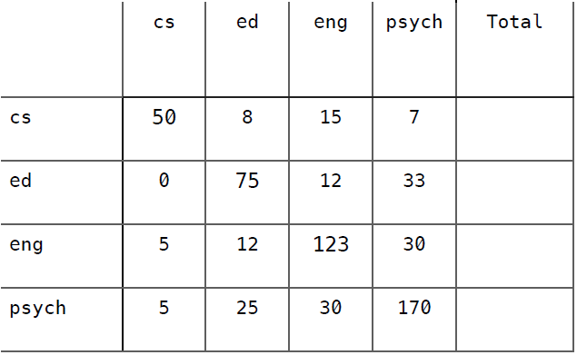
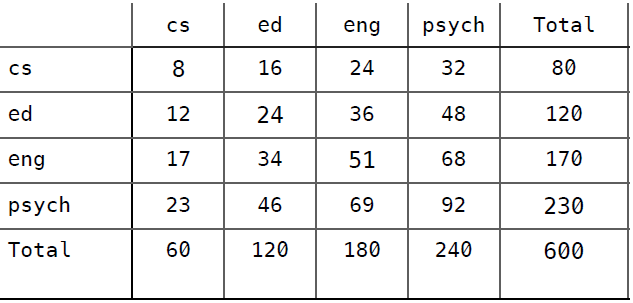

## Kappa指标

本章的开头我们对分类器的效果提了几个问题，并在此之后使用十折交叉验证和混淆矩阵来对分类器进行评估。上一节中我们对加仑公里数分类器的评价结果是53.316%的正确率，那这个结果是好是坏呢？我们就需要使用一个新的指标：Kappa指标。

Kappa指标可以用来评价分类器的效果比随机分类要好多少。我们仍用运动员的例子来说明，以下是它的混淆矩阵：

我增加了“合计”一列，因此在计算正确率时，我们只需将对角线相加（35 + 88 + 28 = 151）除以合计（200）就可以了，结果是0.755。

现在，我们建造另一个混淆矩阵，用来表示随机分类的结果。首先，我们将上表中的数据抹去一部分，只留下合计：

从最后一行可以看到，我们之前构造的分类器将50%的运动员分类到篮球运动员中（200中的100人），20%分到了体操，剩余30%分到了马拉松。即：

* 体操 20%
* 篮球 50%
* 田径 30%

我们会用这个百分比来构造随机分类器的混淆矩阵。比如，真实的体操运动员一共有60人，随机分类器会将其中的20%（12人）分类为体操，50%（30人）分类为篮球，30%（18人）分类为马拉松，填入表格：

继续用这种方法填充空白。100个真实的篮球运动员，20%（20人）分到体操，50%（50人）分到篮球，30%（30人）分到马拉松。

从而得到随机分类器的准确率是：

Kappa指标可以用来衡量我们之前构造的分类器和随机分类器的差异，公式为：

P(c)表示分类器的准确率，P(r)表示随机分类器的准确率。将之前的结果代入公式：

0.61要如何解释呢？可以参考下列经验结果：

*来源：Landis, JR, Koch, GG. 1977 分类效果评估 生物测量学*

**动手实践**

假设我们开发了一个效果不太好的分类器，用来判断600名大学生所读专业，使用的数据是他们对10部电影的评价。这些大学生的专业类别有计算机科学（cs）、教育学（ed）、英语（eng）、心理学（psych）。以下是该分类器的混淆矩阵，尝试计算出它的Kappa指标并予以解释。

准确率 = 0.697

**解答**

首先，计算列合计和百分比：

然后根据百分比来填充随机分类器的混淆矩阵：

准确率 = (8 + 24 + 51 + 92) / 600 = (175 / 600) = 0.292

最后，计算Kappa指标：

这说明分类器的效果还是要好过预期的。

