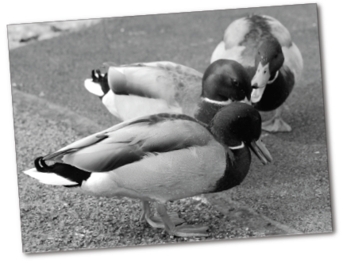
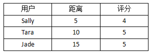
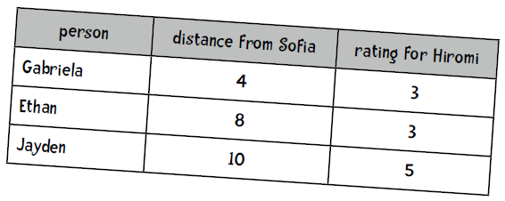

## 优化近邻算法

有一种分类器叫“机械记忆分类器（Rote Classifer）”，它会将数据集完整地保存下来，并用来判断某条记录是否存在于数据集中。

所以，如果我们只对数据集中的数据进行分类，准确率将是100%。而在现实应用中，这种分类器并不可用，因为我们需要判定某条新的记录属于哪个分类。

你可以认为我们上一章中构建的分类器是机械记忆分类器的一种扩展，只是我们不要求新的记录完全对应到数据集中的某一条记录，只要距离最近就可以了。

PangNing Tan等人在其机器学习的教科书中写过这样一段话：如果一只动物走起来像鸭子、叫起来像鸭子、而且看起来也像鸭子，那它很有可能就是一只鸭子。

近邻算法的问题之一是异常数据。还是拿运动员分类举例，不过只看体操和马拉松。

假设有一个比较矮也比较轻的人，她是马拉松运动员，这样就会形成以下这张图，横轴是体重，纵轴是身高，其中m表示马拉松，g表示体操：

可以看到这名特别的马拉松运动员处于体操运动员的群组中。

假设我们要对一名新的运动员进行分类，用图中的x表示，可以看到离她最近的运动员是那名特别的马拉松运动员，这样一来这名新的运动员就会被归到马拉松，但实际上她更有可能是一名体操运动员。

### kNN算法

优化方法之一是考察这条新记录周围距离最近的k条记录，而不是只看一条，因此这种方法称为k近邻算法（kNN）。

每个近邻都有投票权，程序会将新记录判定为得票数最多的分类。比如说，我们使用三个近邻（k = 3），其中两条记录属于体操，一条记录属于马拉松，那我们会判定x为体操。

因此，我们在判定一条记录的具体分类时可以用这种投票的方法。如果两个分类的票数相等，就随机选取一个。

但对于需要预测具体数值的情形，比如一个人对Funky Meters乐队的评分，我们可以计算k个近邻的距离加权平均值。

举个例子，我们需要预测Ben对Funky Meters的喜好程度，他的三个近邻分别是Sally、Tara、和Jade。

下表是这三个人离Ben的距离，以及他们对Funky Meters的评分：

可以看到，Sally离Ben最近，她给Funky Meters的评分是4。

在计算平均值的时候，我希望距离越近的用户影响越大，因此可以对距离取倒数，从而得到下表：

下面，我们把所有的距离倒数除以距离倒数的和（0.2 + 0.1 + 0.067 = 0.367），从而得到评分的权重：

我们可以注意到两件事情：权重之和是1；原始数据中，Sally的距离是Tara的二分之一，这点在权重中体现出来了。

最后，我们求得平均值，也即预测Ben对Funky Meters的评分：

**动手实践**

我们想要预测Sofia对爵士钢琴手Hiromi的评分，以下是她三个近邻的距离和评分：

**解答**

第一步，计算距离的倒数：

第二步，计算权重（距离倒数之和为0.475）：

第三步，预测评分：

