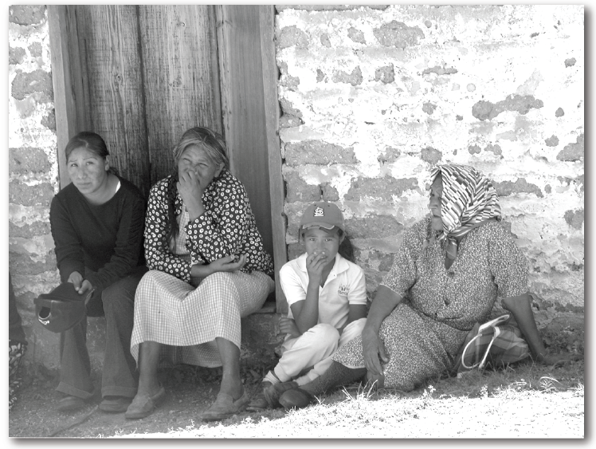
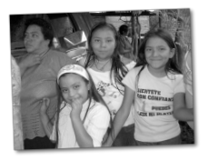
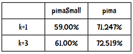

## 新的数据集，新的挑战！

是时候使用新的数据集了——比马印第安人糖尿病数据集，由美国国家糖尿病、消化和肾脏疾病研究所提供。



令人惊讶的是，超过30%的比马人患有糖尿病，而全美的糖尿病患者比例是8.3%，中国只有4.2%。

数据集中的一条记录代表一名21岁以上的比马女性，她们分类两类：五年内查出患有糖尿病，以及没有得病。共选取了8个特征：

1. 怀孕次数；
2. 口服葡萄糖耐量实验两小时后的血浆葡萄糖浓度；
3. 舒张压（mm Hg）；
4. 三头肌皮褶厚度（mm）；
5. 血清胰岛素（mu U/ml）；
6. 身体质量指数（BMI）：体重（公斤）除以身高（米）的平方；
7. 糖尿病家谱；
8. 年龄（岁）。

以下是示例数据，最后一列的0表示没有糖尿病，1表示患有糖尿病：


比如说，第一条记录表示一名生过两次小孩的女性，她的血糖浓度是99，舒张压是52，等等。



**实践[1]**

本书提供了两份数据集：[pimaSmall.zip](https://github.com/yourtion/DataminingGuideBook-Codes/tree/master/chapter-5/pimaSmall.zip)和[pima.zip](https://github.com/yourtion/DataminingGuideBook-Codes/tree/master/chapter-5/pima.zip)。前者包含100条记录，后者包含393条记录，都已经等分成了10个文件（10个桶）。我用前面实现的近邻算法计算了pimaSmall数据集，得到的结果如下：


*提示：代码中的heapq.nsmallest(n, list)会返回n个最小的项。[heapq](https://docs.python.org/2/library/heapq.html)是Python内置的优先队列类库。*

你的任务是实现kNN算法。首先在类的init函数中添加参数k：

```python
def __init__(self, bucketPrefix, testBucketNumber, dataFormat, k):
```

knn函数的签名应该是：

```python
def knn(self, itemVector):
```

它会使用到`self.k`（记得在init函数中保存这个值），它的返回值是0或1。此外，在进行十折交叉验证（tenFold函数）时也要传入k参数。

**解答**

init函数的修改很简单：

```python
def __init__(self, bucketPrefix, testBucketNumber, dataFormat, k):
    self.k = k
    ...
```

knn函数的实现是：

```python
def knn(self, itemVector):
    """使用kNN算法判断itemVector所属类别"""
    # 使用heapq.nsmallest来获得k个近邻
    neighbors = heapq.nsmallest(self.k,
                                [(self.manhattan(itemVector, item[1]), item)
                                 for item in self.data])
    # 每个近邻都有投票权
    results = {}
    for neighbor in neighbors: 
        theClass = neighbor[1][0]
        results.setdefault(theClass, 0)
        results[theClass] += 1
    resultList = sorted([(i[1], i[0]) for i in results.items()], reverse=True)
    # 获取得票最高的分类
    maxVotes = resultList[0][0]
    possibleAnswers = [i[1] for i in resultList if i[0] == maxVotes]
    # 若得票相等则随机选取一个
    answer = random.choice(possibleAnswers)
    return(answer)
```

对tenFold函数的改动如下：

```python
def tenfold(bucketPrefix, dataFormat, k):
    results = {}
    for i in range(1, 11):
        c = Classifier(bucketPrefix, i, dataFormat, k)
        ...
```

你可以从网站上[下载这些代码](https://github.com/yourtion/DataminingGuideBook-Codes/tree/master/chapter-5/pimaKNN.py)，不过我的代码并不一定是最优的，仅供参考。

**实践[2]**

在分类效果上，究竟是数据量的多少比较重要（即使用pimaSmall和pima数据集的效果），还是更好的算法比较重要（k=1和k=3）？

**解答**

以下是比较结果：



看来增加数据量要比使用更好的算法带来的效果好。


**实践[3]**

72.519%的准确率看起来不错，但还是用Kappa指数来检验一下吧：


**解答**

计算合计和比例：


随机分类器的混淆矩阵：


随机分类器的正确率：


Kappa指标：


**效果一般**

### 更多数据，更好的算法，还有抛锚的巴士


几年前我去参加一个墨西哥城的研讨会，比较特别的是会议的第二天是坐观光巴士旅游，观看黑脉金斑蝶等。这辆巴士比较破旧，中途抛锚了好几次，所以我们一群有着博士学位的人就站在路边一边谈笑，一边等着司机修理巴士。而事实证明这段经历是这次会议最大的收获。其间，我有幸与Eric Brill做了交流，他在词性分类方面有着很高的成就，他的算法比前人要优秀很多，从而使他成为自然语言处理界的名人。我和他谈论了分类器的效果问题，他说实验证明增加数据所带来的效果要比改进算法来得大。事实上，如果仍沿用老的词性分类算法，而仅仅增加训练集的数据量，效果很有可能比他现有的算法更好。当然，他不可能通过收集更多的数据来获得一个博士学位，但如果如果你的算法能够取得哪怕一点点改进，也足够了。


当然，这并不是说你就不需要挑选出更好的算法了，我们之前也看到了好的算法所带来的效果也是惊人的。但是如果你只是想解决一个问题，而非发表一篇论文，那增加数据量会更经济一些。

所以，在认同数据量多寡的重要影响后，我们仍将继续学习各种算法。

**人们使用kNN算法来做以下事情：**

* 在亚马逊上推荐商品
* 评估用户的信用
* 通过图像分析来分类路虎车型
* 人像识别
* 分析照片中人物的性别
* 推荐网页
* 推荐旅游套餐
