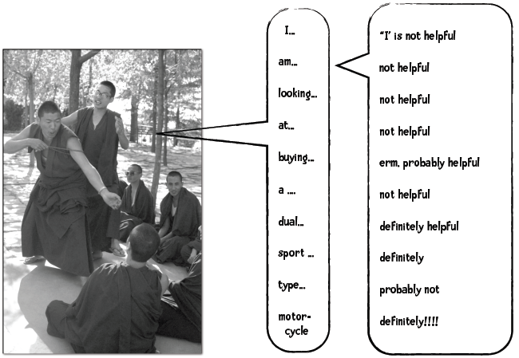
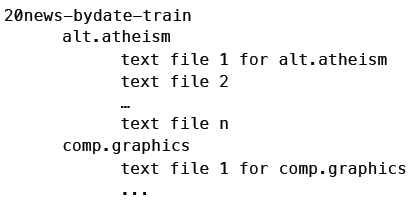
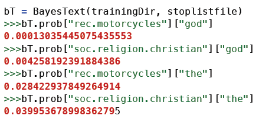
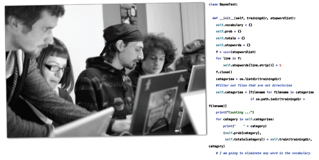
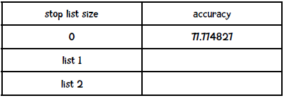
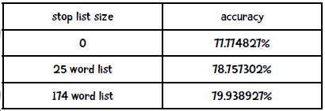

## 新闻组语料库

我们下面要处理的数据集是新闻，这些新闻可以分为不同的新闻组，我们会构造一个分类器来判断某则新闻是属于哪个新闻组的：


比如下面这则新闻是属于rec.motorcycles组的：


注意到这则新闻中还有一些拼写错误（如accesories、ussually等），这对分类器是一个不小的挑战。

这些数据集都来自 http://qwone.com/~jason/20Newsgroups/ （我们使用的是20news-bydate数据集），你也可以从 [这里](http://guidetodatamining.com/guide/data/20news-bydate.zip) 获得。这个数据集包含18,846个文档，并将训练集（60%）和测试集放在了不同的目录中，每个子目录都是一个新闻组，目录中的文件即新闻文本。

### 把不要的东西丢掉！

比如我们要对下面这篇新闻做分类：


让我们看看哪些单词是比较重要的：



(helpful - 重要，not helpful - 不重要）

如果我们将英语中最常用的200个单词剔除掉，这篇新闻就成了这样：


去除掉这些单词后，新闻就只剩下一半大小了。而且，这些单词看上去并不会对分类结果产生影响。H.P. Luhn在他的论文中说“这些组成语法结构的单词是没有意义的，反而会产生很多噪音”。也就是说，将这些“噪音”单词去除后是会提升分类正确率的。我们将这些单词称为“停词”，有专门的停词表可供使用。去除这些词的理由是：

1. 能够减少需要处理的数据量；
2. 这些词的存在会对分类效果产生负面影响。

### 常用词和停词

虽然像the、a这种单词的确没有意义，但有些常用词如work、write、school等在某些场合下还是有作用的，如果将他们也列进停词表里可能会有问题。


> 年轻人，那些常用词是不能随便丢弃的！

因此在定制停词表时还是需要做些考虑的。比如要判别阿拉伯语文档是在哪个地区书写的，可以只看文章中最常出现的词（和上面的方式相反）。如果你有兴趣，可以到我的 [个人网站](http://zacharski.org) 上看看这篇论文。而在分析聊天记录时，强奸犯会使用更多I、me、you这样的词汇，如果在分析前将这些单词去除了，效果就会变差。


> 不要盲目地使用停词表！

### 编写Python代码

首先让我们实现朴素贝叶斯分类器的训练部分。训练集的格式是这样的：



最上层的目录是训练集（20news-bydate-train），其下的子目录代表不同的新闻组（如alt.atheism），子目录中有多个文本文件，即新闻内容。测试集的目录结构也是相同的。因此，分类器的初始化代码要完成以下工作：

1. 读取停词列表；
2. 获取训练集中各目录（分类）的名称；
3. 对于各个分类，调用train方法，统计单词出现的次数；
4. 计算下面的公式：


```python
from __future__ import print_function
import os, codecs, math

class BayesText:

    def __init__(self, trainingdir, stopwordlist):
        """朴素贝叶斯分类器
        trainingdir 训练集目录，子目录是分类，子目录中包含若干文本
        stopwordlist 停词列表（一行一个）
        """
        self.vocabulary = {}
        self.prob = {}
        self.totals = {}
        self.stopwords = {}
        f = open(stopwordlist)
        for line in f:
            self.stopwords[line.strip()] = 1
        f.close()
        categories = os.listdir(trainingdir)
        # 将不是目录的元素过滤掉
        self.categories = [filename for filename in categories
                           if os.path.isdir(trainingdir + filename)]
        print("Counting ...")
        for category in self.categories:
            print('    ' + category)
            (self.prob[category],
             self.totals[category]) = self.train(trainingdir, category)
        # 删除出现次数小于3次的单词
        toDelete = []
        for word in self.vocabulary:
            if self.vocabulary[word] < 3:
                # 遍历列表时不能删除元素，因此做一个标记
                toDelete.append(word)
        # 删除
        for word in toDelete:
            del self.vocabulary[word]
        # 计算概率
        vocabLength = len(self.vocabulary)
        print("Computing probabilities:")
        for category in self.categories:
            print('    ' + category)
            denominator = self.totals[category] + vocabLength
            for word in self.vocabulary:
                if word in self.prob[category]:
                    count = self.prob[category][word]
                else:
                    count = 1
                self.prob[category][word] = (float(count + 1)
                                             / denominator)
        print ("DONE TRAINING\n\n")
                    

    def train(self, trainingdir, category):
        """计算分类下各单词出现的次数"""
        currentdir = trainingdir + category
        files = os.listdir(currentdir)
        counts = {}
        total = 0
        for file in files:
            #print(currentdir + '/' + file)
            f = codecs.open(currentdir + '/' + file, 'r', 'iso8859-1')
            for line in f:
                tokens = line.split()
                for token in tokens:
                    # 删除标点符号，并将单词转换为小写
                    token = token.strip('\'".,?:-')
                    token = token.lower()
                    if token != '' and not token in self.stopwords:
                        self.vocabulary.setdefault(token, 0)
                        self.vocabulary[token] += 1
                        counts.setdefault(token, 0)
                        counts[token] += 1
                        total += 1
            f.close()
        return(counts, total)
```

训练结果存储在一个名为prop的字典里，字典的键是分类，值是另一个字典——键是单词，值是概率。



god这个词在rec.motorcycles新闻组中出现的概率是0.00013，而在soc.religion.christian新闻组中出现的概率是0.00424。

训练阶段的另一个产物是分类列表：


**训练结束了，下面让我们开始进行文本分类吧。**

请尝试编写一个分类器，达成以下效果：




```python
    def classify(self, filename):
        results = {}
        for category in self.categories:
            results[category] = 0
        f = codecs.open(filename, 'r', 'iso8859-1')
        for line in f:
            tokens = line.split()
            for token in tokens:
                #print(token)
                token = token.strip('\'".,?:-').lower()
                if token in self.vocabulary:
                    for category in self.categories:
                        if self.prob[category][token] == 0:
                            print("%s %s" % (category, token))
                        results[category] += math.log(
                            self.prob[category][token])
        f.close()
        results = list(results.items())
        results.sort(key=lambda tuple: tuple[1], reverse = True)
        # 如果要调试，可以打印出整个列表。
        return results[0][0]
```

最后我们编写一个函数对测试集中的所有文档进行分类，并计算准确率：

```python
    def testCategory(self, directory, category):
        files = os.listdir(directory)
        total = 0
        correct = 0
        for file in files:
            total += 1
            result = self.classify(directory + file)
            if result == category:
                correct += 1
        return (correct, total)

    def test(self, testdir):
        """测试集的目录结构和训练集相同"""
        categories = os.listdir(testdir)
        # 过滤掉不是目录的元素
        categories = [filename for filename in categories if
                      os.path.isdir(testdir + filename)]
        correct = 0
        total = 0
        for category in categories:
            print(".", end="")
            (catCorrect, catTotal) = self.testCategory(
                testdir + category + '/', category)
            correct += catCorrect
            total += catTotal
        print("\n\nAccuracy is  %f%%  (%i test instances)" %
              ((float(correct) / total) * 100, total))
```

在不使用停词列表的情况下，这个分类器的效果是：


> 准确率77.77%，看起来很不错。如果用了停词列表效果会如何呢？

> 那让我们来测试一下吧！

请自行到网络上查找一些停词列表，并填写以下表格：



我找到了两个停词列表，分别是包含[25个词](http://nlp.stanford.edu/IR-book/html/htmledition/dropping-common-terms-stop-words-1.html) 和[174个词](http://www.ranks.nl/stopwords) 的列表，结果如下：



看来第二个停词列表能提升2%的效果，你的结果如何？

