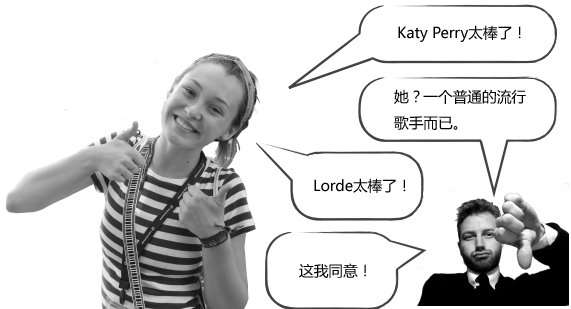
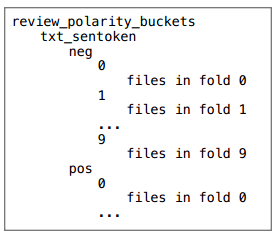
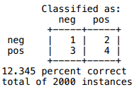
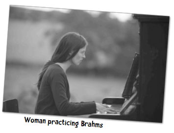
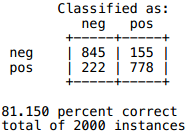

## 朴素贝叶斯与情感分析

情感分析的目的是判断作者的态度或意见：

情感分析的例子之一是判断一篇评论是正面的还是反面的，我们可以用朴素贝叶斯算法来实现。我们可以用Pang&Lee 2004的影评数据来测试，这份数据集包含1000个正面和1000个负面的评价，以下是一些示例：

> 本月第二部连环杀人犯电影实在太糟糕了！虽然开头的故事情节和场景布置还可以，但后面就……

> 当我听说罗密欧与朱丽叶又出了一部改编电影后，心想莎士比亚的经典又要被糟蹋了。不过我错了，Baz Luhrman导演的水平还是高的……

你可以从 http://www.cs.cornell.edu/People/pabo/movie-review-data/ 上下载这个数据集，并整理成以下形式：

你也可以从[这里](http://guidetodatamining.com/guide/data/reviewPolarityBuckets.zip)下载整理好的数据。

**动手实践**

你可以为上文的朴素贝叶斯分类器增加十折交叉验证的逻辑吗？它的输出结果应该是如下形式：

另外，请计算Kappa指标。

**再次声明：只看不练是不行的，就好比你不可能通过阅读乐谱就学会弹奏钢琴。**

**解答**

这是我得到的结果：

Kappa指标则是：

所以我们的分类算法效果是不错的。

[代码链接](https://github.com/yourtion/DataminingGuideBook-Codes/tree/master/chapter-7/bayesSentiment.py)
