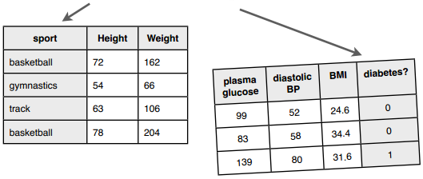

第八章：聚类
============

原文：http://guidetodatamining.com/chapter8/

内容：

* 层次聚类法
* 编写层次聚类算法
* k-means聚类算法
* 安然事件

前几章我们学习了如何构建分类系统，使用的是已经标记好类别的数据集进行训练：

训练完成后我们就可以用来预测了：这个人看起来像是篮球运动员，那个人可能是练体操的；这个人三年内不会患有糖尿病。

可以看到，分类器在训练阶段就已经知道各个类别的名称了。那如果我们不知道呢？如何构建一个能够自动对数据进行分组的系统？比如有1000人，每人有20个特征，我想把这些人分为若干个组。

这个过程叫做聚类：通过物品特征来计算距离，并自动分类到不同的群集或组中。有两种聚类算法比较常用：

**k-means聚类算法**

我们会事先告诉这个算法要将数据分成几个组，比如“请把这1000个人分成5个组”，“将这些网页分成15个组”。这种方法就叫k-means，我们会在后面的章节讨论。

