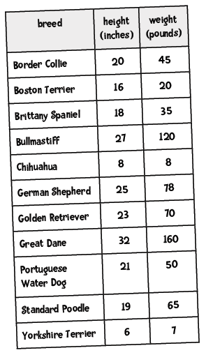
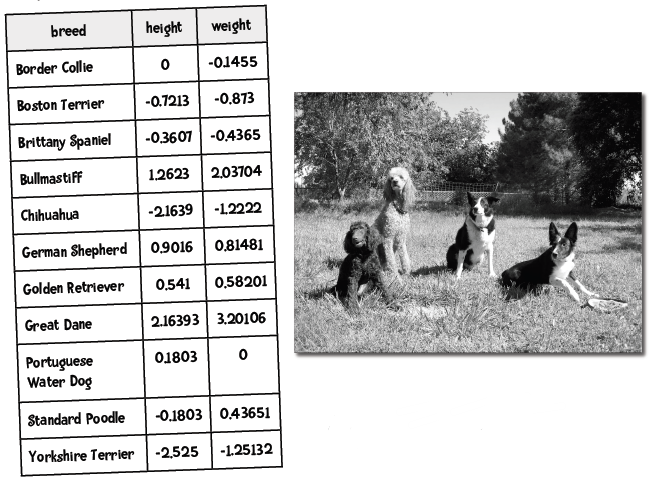
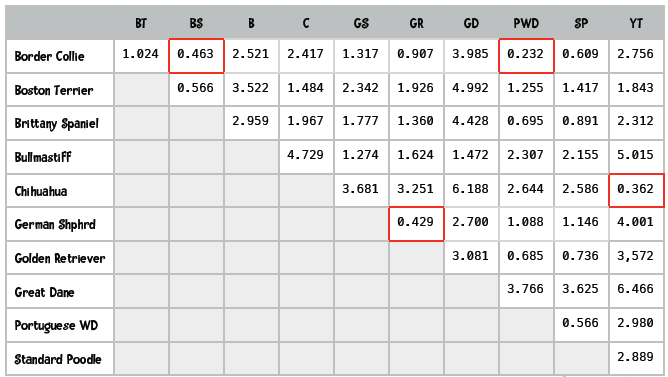
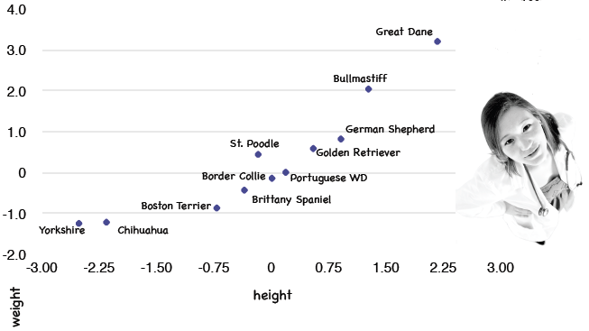
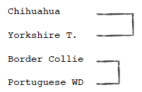
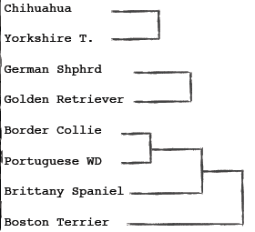
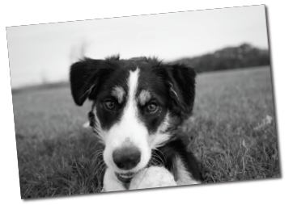

## 层次聚类法

对于层次聚类法，我们不需要预先指定分类的数量，这个算方法会将每条数据都当作是一个分类，每次迭代的时候合并距离最近的两个分类，直到剩下一个分类为止。因此聚类的结果是：顶层有一个大分类，这个分类下有两个子分类，每个子分类下又有两个子分类，依此类推，层次聚类也因此得命。

在合并的时候我们会计算两个分类之间的距离，可以采用不同的方法。如下图中的A、B、C三个分类，我们应该将哪两个分类合并起来呢？

### 单链聚类

在单链聚类中，分类之间的距离由两个分类相距最近的两个元素决定。如上图中分类A和分类B的距离由A1和B1的距离决定，因为这个距离小于A1到B2、A2到B1的距离。这样一来我们会将A和B进行合并。

### 全链聚类

在全链聚类中，分类之间的距离由两个分类相距最远的两个元素决定。因此上图中分类A和B的距离是A2到B2的距离，最后会将分类B和C进行合并。

### 平均链接聚类

在这种聚类方法中，我们通过计算分类之间两两元素的平均距离来判断分类之间的距离，因此上图中会将分类B和C进行合并。

> 下面让我们用单链聚类法举个例子吧！

我们来用狗的高度和重量来进行聚类：

> 在计算距离前我们是不是忘了做件事？

> 标准化！我们先将这些数据转换为修正的标准分。

然后我们计算欧几里德距离，图中高亮了一些最短距离：

根据下面的图表，你能看出哪两个品种的距离最近吗？

> 如果你看出是Border Collie和Portuguese Water Dog最近，那就对了！

**计算过程**

第一步：我们找到距离最近的两个元素，对他们进行聚类：

第二步：再找出距离最近的两个元素，进行聚类：

第三步：继续重复上面的步骤：

第四步：继续查找距离最近的元素，发现Border Collie已经属于一个分类的，因此进行如下图所示的合并：

> 这叫树状图，可以用来表示聚类。

**动手实践**

你能在下图的基础上继续完成聚类吗？

**解答**

