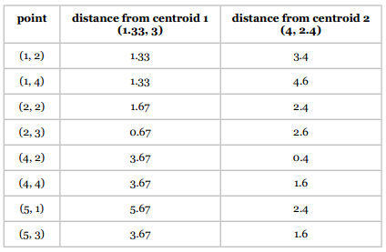
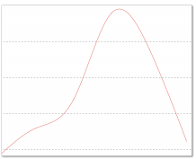
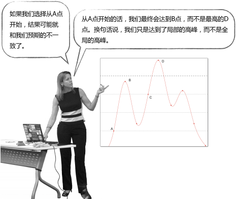
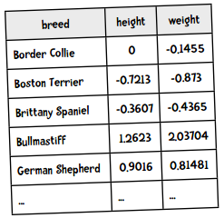
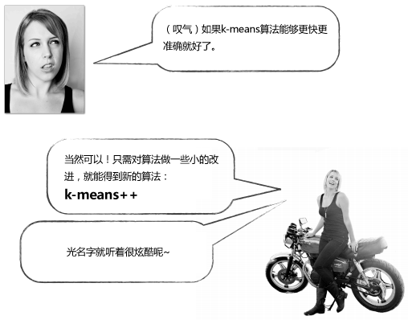
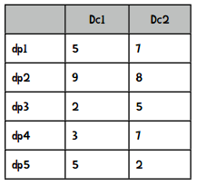
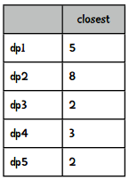
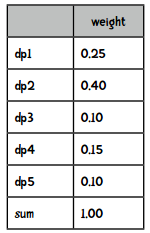
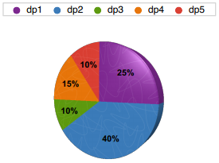

## k-means聚类算法

使用k-means算法时需要指定分类的数量，这也是算法名称中“k”的由来。


> k-means是Lloyd博士在1957年提出的，虽然这个算法已有50年的历史，但却是当前最流行的聚类算法！

下面让我们来了解一下k-means聚类过程：


1. 我们想将图中的记录分成三个分类（即k=3），比如上文提到的犬种数据，坐标轴分别是身高和体重。
2. 由于k=3，我们随机选取三个点来作为聚类的起始点（分类的中心点），并用红黄蓝三种颜色标识。
3. 然后，我们根据其它点到中心点的距离来进行分配，这样就能将这些点分成三类了。
4. 计算这些分类的中心点，以此作为下一次计算的起始点。重复这个过程，直到中心点不再变动，或迭代次数超过某个阈值为止。

所以k-means算法可概括为：

1. 随机选取k个元素作为中心点；
2. 根据距离将各个点分配给中心点；
3. 计算新的中心点；
4. 重复2、3，直至满足条件。

我们来看一个示例，将以下点分成两个分类：


**第一步 随机选取中心点**

我们选取(1, 4)作为分类1的中心点，(4, 2)作为分类2的中心点；

**第二步 将各点分配给中心点**

可以用各类距离计算公式，为简单起见，这里我们使用曼哈顿距离：


聚类结果如下：


**第三步 更新中心点**

通过计算平均值来更新中心点，如x轴的均值是：

(1 + 1 + 2) / 3 = 4 / 3 = 1.33

y轴是：

(2 + 4 + 3) / 3 = 9 / 3 = 3

因此分类1的中心点是(1.33, 3)。计算得到分类2的中心点是(4, 2.4)。

**第四步 重复前面两步**

两个分类的中心点由(1, 4)、(4, 2)变为了(1.33, 3)、(4, 2.4)，我们使用新的中心点重新计算。

**重复第二步 将各点分配给中心点**

同样是计算曼哈顿距离：



新的聚类结果是：


**重复第三步 更新中心点**

* 分类1：(1.5, 2.75)
* 分类2：(4.5, 2.5)

**重复第二步 将各点分配给中心点**


**重复第三步 更新中心点**

* 分类1：(1.5, 2.75)
* 分类2：(4.5, 2.5)

可以看到中心点并没有改变，所以计算也就结束了。


> 当中心点不再变化时，或者说不再有某个点从一个分类转移到另一个分类时，我们就会停止计算。这个时候我们称该算法已经收敛。算法运行过程中，中心点的大幅转移是在前几次迭代中产生的，后面的迭代中变动的幅度就会减小。也就是说，k-means算法的重点是在前期迭代，而后期的迭代只是细微的调整。


> 基于k-means的这种特点，我们可以将“没有点发生转移”弱化成“少于1%的点发生转移”来作为计算停止条件，这也是最普遍的做法。


> k-means好简单呀！

**扩展阅读**

k-means是一种最大期望算法，这类算法会在“期望”和“最大化”两个阶段不断迭代。比如k-means的期望阶段是将各个点分配到它们所“期望”的分类中，然后在最大化阶段重新计算中心点的位置。如果你对此感兴趣，可以前去阅读[维基百科](http://en.wikipedia.org/wiki/Expectation%E2%80%93maximization_algorithm)上的词条。

### 登山式算法

再继续讨论k-means算法之前，我想先介绍一下登山式算法。


假设我们想要登上一座山的顶峰，可以通过以下步骤实现：

1. 在山上随机选取一个点作为开始；
2. 向高处爬一点；
3. 重复第2步，直到没有更高的点。

这种做法看起来很合理，比如对于下图所示的山峰：



无论我们从哪个点开始攀登，最终都可以达到顶峰。

但对于下面这张图：



所以说，这种简单的登山式算法并不一定能得到最优解。

k-means就是这样一种算法，它不能保证最终结果是最优的，因为我们一开始选择的中心点是随机的，很有可能就会选到上面的A点，最终获得局部最优解B点。因此，最终的聚类结果和起始点的选择有很大关系。但尽管如此，k-means通常还是能够获得良好的结果的。


> 那我们如何比较不同的聚类结果呢？

### 误差平方和（SSE）

我们可以使用误差平方和（或称离散程度）来评判聚类结果的好坏，它的计算方法是：计算每个点到中心点的距离平方和。


上面的公式中，第一个求和符号是遍历所有的分类，比如i=1时计算第一个分类，i=2时计算第二个分类，直到计算第k个分类；第二个求和符号是遍历分类中所有的点；Dist指代距离计算公式（如曼哈顿距离、欧几里得距离）；计算数据点x和中心点c<sub>i</sub>之间的距离，平方后相加。

假设我们对同一数据集使用了两次k-means聚类，每次选取的起始点不一样，想知道最后得到的聚类结果哪个更优，就可以计算和比较SSE，结果小的效果好。


> 下面让我们开始编程吧！

```python
import math
import random 


"""
K-means算法
"""

def getMedian(alist):
    """计算中位数"""
    tmp = list(alist)
    tmp.sort()
    alen = len(tmp)
    if (alen % 2) == 1:
        return tmp[alen // 2]
    else:
        return (tmp[alen // 2] + tmp[(alen // 2) - 1]) / 2
    

def normalizeColumn(column):
    """计算修正的标准分"""
    median = getMedian(column)
    asd = sum([abs(x - median) for x in column]) / len(column)
    result = [(x - median) / asd for x in column]
    return result


class kClusterer:
    """kMeans聚类算法，第一列是分类，其余列是数值型特征"""
    
    def __init__(self, filename, k):
        """k是分类的数量，该函数完成以下功能：
           1. 读取filename的文件内容
           2. 按列存储到self.data变量中
           3. 计算修正的标准分
           4. 随机选取起始点
           5. 将各个点分配给中心点
        """
        file = open(filename)
        self.data = {}
        self.k = k
        self.counter = 0
        self.iterationNumber = 0
        # 用于跟踪本次迭代有多少点的分类发生了变动
        self.pointsChanged = 0
        # 误差平方和
        self.sse = 0
        #
        # 读取文件
        #
        lines = file.readlines()
        file.close()
        header = lines[0].split(',')
        self.cols = len(header)
        self.data = [[] for i in range(len(header))]
        # 按列存储数据，如self.data[0]是第一列的数据，
        # self.data[0][10]是第一列第十行的数据。
        for line in lines[1:]:
            cells = line.split(',')
            toggle = 0
            for cell in range(self.cols):
                if toggle == 0:
                   self.data[cell].append(cells[cell])
                   toggle = 1
                else:
                    self.data[cell].append(float(cells[cell]))
                    
        self.datasize = len(self.data[1])
        self.memberOf = [-1 for x in range(len(self.data[1]))]
        #
        # 标准化
        #
        for i in range(1, self.cols):
                self.data[i] = normalizeColumn(self.data[i])

        # 随机选取起始点
        random.seed()
        self.centroids = [[self.data[i][r]  for i in range(1, len(self.data))]
                           for r in random.sample(range(len(self.data[0])),
                                                 self.k)]
        self.assignPointsToCluster()

            

    def updateCentroids(self):
        """根据分配结果重新确定聚类中心点"""
        members = [self.memberOf.count(i) for i in range(len(self.centroids))]
        self.centroids = [[sum([self.data[k][i]
                                for i in range(len(self.data[0]))
                                if self.memberOf[i] == centroid])/members[centroid]
                           for k in range(1, len(self.data))]
                          for centroid in range(len(self.centroids))] 
            
        
    
    def assignPointToCluster(self, i):
        """根据距离计算所属中心点"""
        min = 999999
        clusterNum = -1
        for centroid in range(self.k):
            dist = self.euclideanDistance(i, centroid)
            if dist < min:
                min = dist
                clusterNum = centroid
        # 跟踪变动的点
        if clusterNum != self.memberOf[i]:
            self.pointsChanged += 1
        # 计算距离平方和
        self.sse += min**2
        return clusterNum

    def assignPointsToCluster(self):
        """分配所有的点"""
        self.pointsChanged = 0
        self.sse = 0
        self.memberOf = [self.assignPointToCluster(i)
                         for i in range(len(self.data[1]))]
        

        
    def euclideanDistance(self, i, j):
        """计算欧几里得距离"""
        sumSquares = 0
        for k in range(1, self.cols):
            sumSquares += (self.data[k][i] - self.centroids[j][k-1])**2
        return math.sqrt(sumSquares)

    def kCluster(self):
        """开始进行聚类，重复以下步骤：
        1. 更新中心点
        2. 重新分配
        直至变动的点少于1%。
        """
        done = False
 
        while not done:
            self.iterationNumber += 1
            self.updateCentroids()
            self.assignPointsToCluster()
            #
            # 如果变动的点少于1%则停止迭代
            #
            if float(self.pointsChanged) / len(self.memberOf) <  0.01:
                done = True
        print("Final SSE: %f" % self.sse)

    def showMembers(self):
        """输出结果"""
        for centroid in range(len(self.centroids)):
             print ("\n\nClass %i\n========" % centroid)
             for name in [self.data[0][i]  for i in range(len(self.data[0]))
                          if self.memberOf[i] == centroid]:
                 print (name)
        
##
## 对犬种数据进行聚类，令k=3
###
# 请自行修改文件路径
km = kClusterer('../../data/dogs.csv', 3)
km.kCluster()
km.showMembers()
```


> 我们来分析一下这段代码。

犬种数据用表格来展示是这样的，身高和体重都做了标准化：



因为需要按列存储，转化后的Python格式是这样的：

```python
data = [['Border Collie', 'Bosten Terrier', 'Brittany Spaniel', ...],
        [0, -0.7213, -0.3607, ...],
        [-0.1455, -0.7213, -0.4365, ...],
        ...]
```

我们在层次聚类中用的也是此法，这样做的好处是能够方便地应用不同的数学函数。比如计算中位数和计算标准分的函数，都是以列表作为参数的：

```python
>>> normalizeColumn([8, 6, 4, 2])
[1.5, 0.5, -0.5, -1.5]
```

`__init__`函数首先将文件读入进来，按列存储，并进行标准化。随后，它会选取k个起始点，并将记录中的点分配给这些中心点。`kCluster`函数则开始迭代计算中心点的新位置，直到少于1%的点发生变动为止。

程序的运行结果如下：

```
Final SSE: 5.243159

Class 0
=======
Bullmastiff
Great Dane

Class 1
=======
Boston Terrier
Chihuahua
Yorkshire Terrier

Class 2
=======
Border Collie
Brittany Spaniel
German Shepherd
Golden Retriever
Portuguese Water Dog
Standard Poodle
```

聚类结果非常棒！

**动手实践**

用上面的聚类程序来对麦片数据集进行聚类，令k=4，并回答以下问题：

1. 甜味麦片都被聚类到一起了吗，如Cap'n'Crunch, Cocoa Puffs, Froot Loops, Lucky Charms？
2. 麸类麦片聚到一起了吗，如100% Bran, All-Bran, All-Bran with Extra Fiber, Bran Chex？
3. Cheerios被分到了哪个类别，是不是一直和Special K一起？

再来对加仑公里数的数据进行聚类，令k=8。运行结果大致令人满意，但有时候会出现记录数为空的分类。


> 我要求聚类成8个分类，但其中一个是空的，肯定代码有问题！

我们用示例来看这个问题，假设需要将以下8个点分成3个类别：


我们选取1、7、8作为起始点，因此第一次聚类的结果是：


随后，我们重新计算中心点，即下图中的加号：


这时，6离蓝色中心点较近，7离绿色中心点较近，因此粉色的分类就为空了。

所以说，虽然我们指定了k的值，但不代表最终结果就会有k个分类。这通常是好事，比如上面的例子中，看起来就应该要分成两类。如果有1000条数据，我们指定k=10，但结果有两个为空，那很有可能这个数据集本来就该分成8个类别，因此可以尝试用k=8来重新计算。

另一方面，如果你要求分类都不为空，那就需要改变一下算法：当发现空的分类时，就重新指定这个分类的中心点。一种做法是选取离这个中心点最远的点，比如上面的例子中，发现粉色分类为空，就将中心点变为点1，因为它离粉色中心点最远。



### k-means++

前面我们提到k-means是50年代发明的算法，它的实现并不复杂，但仍是现今最流行的聚类算法。不过它也有一个明显的缺点。在算法一开始需要**随机**选取k个起始点，正是这个随机会有问题。有时选取的点能产生最佳结果，而有时会让结果变得很差。k-means++则改进了起始点的选取过程，其余的和k-means一致。

以下是k-means++选取起始点的过程：

1. 随机选取一个点；
2. 重复以下步骤，直到选完k个点：
    1. 计算每个数据点（dp）到各个中心点的距离（D），选取最小的值，记为D(dp)；
    2. 根据D(dp)的概率来随机选取一个点作为中心点。

我们来讲解一下何为“根据D(dp)的概率来随机选取”。假设选取过程进行到一半，已经选出了两个点，现在需要选第三个。假设还有五个点可供选择，它们离已有的两个中心点的距离是：



*Dc1表示到中心点1的距离，Dc2表示到中心点2的距离。*

我们选取最小的距离：



然后将这些数值转化成总和为1的权重值，做法就是将每个距离除以距离的和（20），得到：



我们可以通过转盘游戏来理解：



比如我们扔个球到这个转盘里，它停在哪个颜色就选取这个点作为新的中心点。这就叫做“根据D(dp)的概率来随机选取”。

比如我们有以下Python数据：

```python
data = [('dp1', 0.25), ('dp2', 0.4), ('dp3', 0.1),
        ('dp4', 0.15), ('dp5', 0.1)]
```

然后来编写一个函数来完成选取过程：

```python
import random
random.seed()

def roulette(datalist):
    i = 0
    soFar = datalist[0][1]
    ball = random.random()
    while soFar < ball:
        i += 1
        soFar += datalist[i][1]
    return datalist[i][0]
```

如果这个函数运行正确，我们选取100次的话，其中25次应该是dp1，40次是dp2，10次是dp3，15次是dp4，10次是dp5。让我们来测试一下：

```python
import collections
results = collections.defaultdict(int)
for i in range(100):
    results[roulette(data)] += 1
print results

{'dp5': 11, 'dp4': 15, 'dp3': 10, 'dp2': 38, 'dp1': 26}
```

结果是符合预期的！

k-means++选取起始点的方法总结下来就是：第一个点还是随机的，但后续的点就会尽量选择离现有中心点更远的点。


> 好了，下面让我们开始写代码吧！

**代码实践**

你能用Python实现k-means++算法吗？k-means++和k-means的唯一区别就是起始点的选取过程，你需要做的是将下面的代码：

```python
self.centroids = [[self.data[i][r] for i in range(1, len(self.data))]
                   for r in random.sample(range(len(self.data[0])),
                                          self.k)]
```

替换为：

```python
self.selectInitialCentroids()
```

你的任务就是编写这个函数！


**解答**

```python
def distanceToClosestCentroid(self, point, centroidList):
    result = self.eDistance(point, centroidList[0])
    for centroid in centroidList[1:]:
        distance = self.eDistance(point, centroid)
        if distance < result:
            result = distance
    return result

def selectInitialCentroids(self):
    """实现k-means++算法中的起始点选取过程"""
    centroids = []
    total = 0
    # 首先随机选取一个点
    current = random.choice(range(len(self.data[0])))
    centroids.append(current)
    # 开始选取剩余的点
    for i in range(0, self.k - 1):
        # 计算每个点到最近的中心点的距离
        weights = [self.distanceToClosestCentroid(x, centroids) 
                   for x in range(len(self.data[0]))]
        total = sum(weights)
        # 转换为权重
        weights = [x / total for x in weights]
        # 开始随机选取
        num = random.random()
        total = 0
        x = -1
        # 模拟轮盘游戏
        while total < num:
            x += 1
            total += weights[x]
        entroids.append(x)
    self.centroids = [[self.data[i][r]  for i in range(1, len(self.data))]
                      for r in centroids]
```

