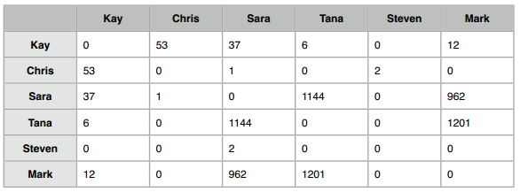
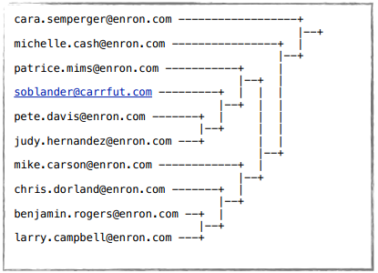
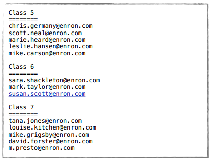

## 安然事件

你应该还对这件事有些印象吧？安然公司曾是一家超大型企业，有着千亿元的收入和两万名员工（微软只有220亿收入）。由于管理体制的破败和受贿，包括人为制造能源危机致使加州大停电，安然公司最终面临破产，大批人员被判入狱。有一部名为“The Smartest Guys in the Room”的纪录片，读者可以到Netflix或亚马逊上观看。


> 安然事件的确挺有趣的，不过这和数据挖掘有什么关系呢？


> 在调查过程中，美国联邦能源管理委员会收获了60万封公司内部邮件。这些邮件可以从网络上下载：

> http://en.wikipedia.org/wiki/Enron_Corpus

> https://www.cs.cmu.edu/~./enron/

我们来用其中的一小部分数据来举例，下表整理了一些公司人员互通邮件的次数：



可以在[这里](https://github.com/yourtion/DataminingGuideBook-Codes/tree/master/chapter-8/enrondata.txt)下载缩减后的数据集。完整的数据在[这里](http://guidetodatamining.com/guide/data/enronMongoDump.zip)，超过300MB。

**动手实践**

你能使用层次聚类算法将这些人分成若干类别吗？

**解答**

我们会通过两个人收发邮件的对象来计算相似度。比如我经常和Ann、Ben、Clara等人通信，你也一样，那么我俩就是相似的：


但如果将你我之间的通信也计算进去：


可以看到，你向我发送了190次邮件，而我只向自己发送了2封邮件。用欧几里得距离来计算的话，在不包含me和you这两列时，我们的距离是46，包含后距离是269！因此在计算两人的距离时需要排除这个因素：

```python
def distance(self, i, j):
    # 针对安然数据进行的修正
    sumSquares = 0
    for i in range(1, self.cols):
        if k != i and k != j:
            sumSquares += (self.data[k][i] - self.data[k][j]) ** 2
    return math.sqrt(sumSquares)
```

得到的层次聚类结果是：



我还用k-means++算法进行了聚类，结果是：



这些结果很有趣，比如分类5中大都是贸易人员，分类7中则多是管理层。


> 安然数据中还能挖掘出很多有趣的模式，去下载完整的数据集进行尝试吧！

> 你也可以对其它数据集进行聚类，看看是否有新的发现。

> 最后，恭喜完成第八章的学习！
